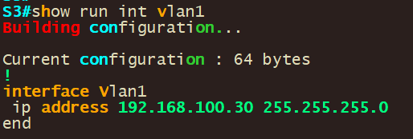
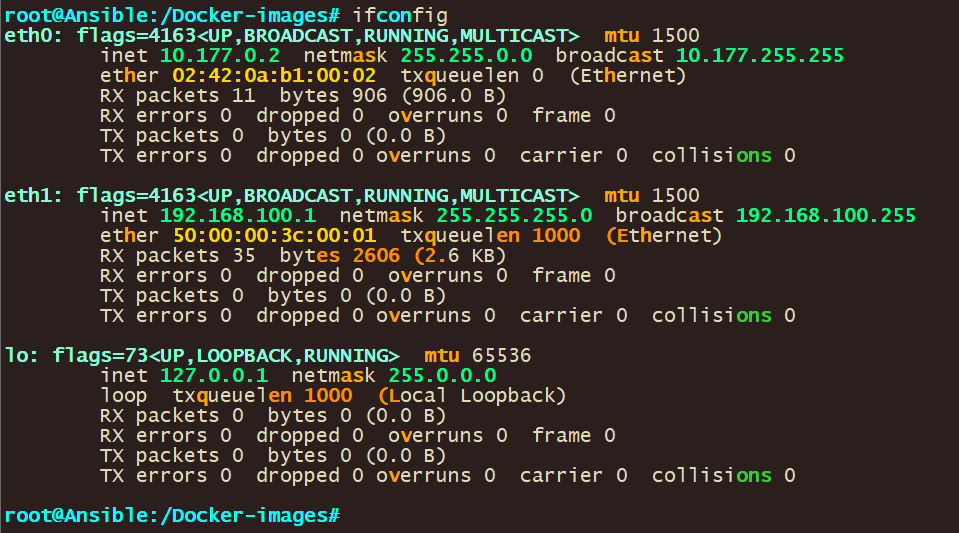
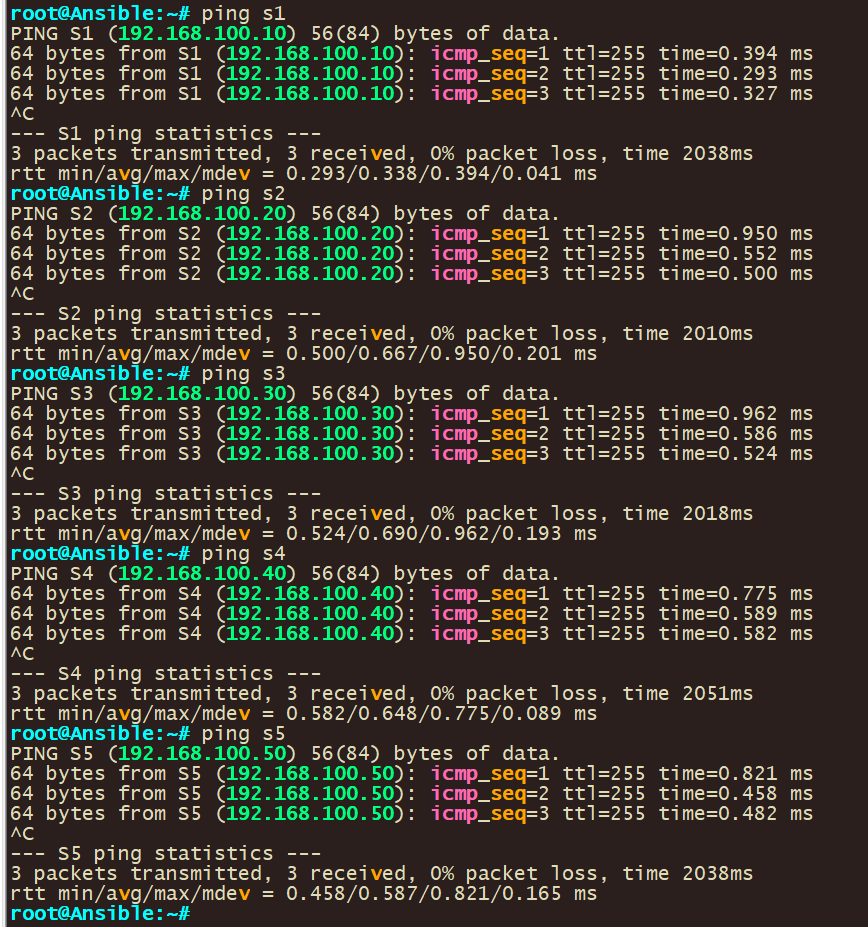

# Ansible Ad-Hoc command w/ RAW module Basic lab use case

In this lab activity, the focal point is on leveraging Ansible ad-hoc commands, with an emphasis on the RAW Module, to establish connections to devices that do not support or have Python enabled. Ansible, an open-source automation tool, is adept at managing network device configurations. Unlike executing playbooks, which entail a series of tasks, Ansible ad-hoc commands are standalone commands designed for executing quick, immediate tasks.

**The RAW Module in Ansible is particularly useful in environments where devices do not support Python**. This module allows for the execution of commands in their native form, without relying on the Ansible”s module facility. Therefore, even in the absence of Python, the RAW Module facilitates seamless interactions with the devices.

See Ansible official documentation for more information: <https://docs.ansible.com/ansible/latest/command_guide/intro_adhoc.html>

Through this lab, you will garner hands-on experience on the versatility of Ansible ad-hoc commands, especially when employing the RAW Module for devices devoid of Python support or Ansible playbooks.

We will use the following topology:


Here are some of the information on lab devices

| **Hostname** |                                              |
|--------------|----------------------------------------------|
| **Ansible**  | EVE-NG/GNS3 Network appliance @192.168.100.1 |
| **S1**       | Cisco Switch running vios_l2 @192.168.100.10 |
| **S2**       | Cisco Switch running vios_l2 @192.168.100.20 |
| **S3**       | Cisco Switch running vios_l2 @192.168.100.30 |
| **S4**       | Cisco Switch running vios_l2 @192.168.100.40 |
| **S5**       | Cisco Switch running vios_l2 @192.168.100.50 |

Prerequires:

-   EVE-NG/GNS3
-   Ansible appliance
-   Cisco images for EVE-NG/GNS3

**To execute Ansible ad-hoc commands, certain prerequisites are required:**

1.  **Ansible Installation on a Control Node**: This could be your personal computer or a dedicated server that serves as the communication bridge between Ansible and your network devices. In this lab, we utilize an EVE-NG/GNS3 provided automation appliance. The EVE-NG/GNS3 network container is equipped with widely utilized network automation tools such as Netmiko, NAPALM, Pyntc, and Ansible.
2.  **Python**: Given that Ansible is developed in Python, it”s imperative to have Python installed on the control node. However, as we are utilizing the Network appliance, this requirement is already satisfied.
3.  **Network Modules**: Ansible employs network modules (e.g., ios_command for Cisco IOS devices) to foster interactions with network devices.

Proceeding to create a sample lab with Ansible ad-hoc commands targeting Cisco devices, the primary steps encompass:

1.  **Ansible Installation on the Control Node**: This can be achieved via a package manager such as apt or yum, with the assumption that the control node setup is already in place.
2.  **Host File Setup**: Ansible necessitates an inventory file to keep track of the hosts constituting your network.
3.  **Router/Switch Connectivity Test**: Employing Ansible”s ping module, you can ascertain the connectivity to the Cisco router.
4.  **Command Execution on Router**: Utilize ad-hoc commands to execute commands on the router, particularly focusing on the raw module for devices without Ansible playbooks.
5.  **Output Filtering**: Ansible facilitates output filtering to extract the desired information.
6.  **Output Saving**: The ad-hoc commands also enable saving the output to a file for future reference or analysis.
7.  **Ansible use case**: The ad-hoc commands enable troubleshooting and saving of output to a file for future reference or analysis.

## Step 1: Configure Switch

First, we have to configure the S1 for connectivity and to allow ssh. Use the below configs for S1

```
no ip domain name lookup
no logging console
cdp run
host S1
int Vlan1
 ip address 192.168.100.10 255.255.255.0
 no shut
username user privilege 15 secret password
line con 0
login local
line aux 0
line vty 0 4
 login local
 transport input all
 ip domain-name www.Test.home
crypto key generate rsa
1024
```


**Let”s go through each of the commands listed:**

**no ip domain name lookup**: This command disables DNS lookup. Without this, any mistyped command in the console is interpreted as a hostname by the router, and it will attempt to resolve it via DNS, which can cause a delay.

**no logging console**: This command disables logging to the console. By default, the router sends all log messages to its console port. Therefore, disabling this can be helpful in not interrupting CLI access with log messages.

**cdp run**: This command enables the Cisco Discovery Protocol (CDP). CDP is a Cisco proprietary protocol used to discover Cisco devices in your network.

**host S1**: This command changes the hostname of the device to "S1".

**int vlan 1**: This command enters the configuration mode for VLAN 1.

**ip address 192.168.100.10 255.255.255.0**: This command assigns the IP address 192.168.100.10 with a subnet mask of 255.255.255.0 to VLAN 1.

**no shut**: This command brings up the VLAN interface if it”s administratively down. It”s equivalent to "enable this interface".

**username user privilege 15 secret password:** This command creates a user with the username "user", assigns it a privilege level of 15 (the highest level, equivalent to root or admin), and sets the password to "password". The keyword "secret" indicates that the password will be stored in a hashed format.

**line con 0**: This command enters line configuration mode for the console port.

**login local**: This command sets the login method to use the local user database for authentication. It”s used here for the console and VTY lines, meaning that the username and password set earlier will be used for console and remote logins.

**line vty 0 4**: This command enters line configuration mode for the first 5 VTY lines (0-4). VTY lines are used for Telnet and SSH access to the device.

**transport input all**: This command is also used under vty configuration mode. It allows all types of protocols (telnet, SSH, etc.) for remote access. However, for security purposes, it is recommended to allow only SSH (i.e., “transport input ssh”).

**ip domain-name www.Test.home**: This command sets the domain name of the device to www.Test.home. This is required for generating the RSA keys which are used by SSH for encryption and decryption.

**crypto key generate rsa**: This command initiates the process of generating RSA keys which are required for SSH. After entering this command, you will be prompted to enter the modulus size.

**1024**: This is the modulus size for the RSA keys. It represents the key length of 1024 bits. The larger the key size, the more secure the SSH connection, but at the cost of more processor overhead.

These commands together configure your Cisco IOS device for secure remote access, enabling you to manage your device without needing to be physically connected to it. It also disables some default settings like DNS lookup on mistyped commands and console logging.

Once configured Vlan1 should have a IP in place





-   Repeat this step for all of S2-5 assigning them different IP”s and hostname according to the IP”s listed above

## Step 2: Configure Network connectivity to Ansible and verify connectivity.

\-Next, we have to configure the Ansible control node and verify that we can reach our router/switch.-

1\. To statically configure a network right click the docker container and set the static ip: **192.168.100.1/24 in our case**

Note: If you downloaded ansible and installed it on ansible you make changes in /etc/network/interfaces to set the IP on a interface by opening the “/etc/network/interfaces” file using a text editor


**Save the changes**

2\. Restart/Start the network appliance and validate that your configs took by running the **ifconfig** command.



You should see the ip address you configured on the network adapter on the output.

1.  Validate network connectivity by pinging all the devices you want to reach

The command **ping 192.168.100.10** is used to test the network connectivity from the ansible control node to SW1 with the IP address 192.168.100.10 and so forth for the other switches/destination


## Step 3: Configure Ansible

1.  Validate that you can ssh into S1

    ssh [user@192.168.100.10](mailto:user@192.168.100.10)

    Configure host resolution.

2.  Add entries into the default host file for your devices using the below command: **nano /etc/hosts**

    

3.  Add in entries for your devices.

| 192.168.100.10 S1 192.168.100.20 S2 192.168.100.30 S3 192.168.100.40 S4 5 |
|---------------------------------------------------------------------------|

1.  Validate that host resolution is working by pinging device host entire name.

    

2.  Create inventory file for ansible. This will be used to tell Ansible what hosts to use.
    1.  Navigate to the parent directory with cd and verify your path with pwd

| Use commands below; cd pwd |
|----------------------------|


1.  Create new inventory file that will be used for hosts. An Ansible Inventory File is a cornerstone in Ansible”s architecture, functioning as a manifest that defines the nodes or hosts upon which tasks and playbooks will be executed.

| Use commands below; nano hosts |
|--------------------------------|

1.  Configure your hostname in the file with group names

|   |
|---|

```

```

****

1.  Configure ansible configuration file to use your newly created host file.
    -   Checking the ansible inventory you can see that although you configured hosts ansible is not able to see your host file
        -   Use the below command to check ansible host file: **ansible –list-hosts all**

            

        -   Create new local ansible configuration file with below command: **nano ansible.cfg**

            Use below configs for the ansible configuration file and then save the file.

```
[defaults]
inventory = ./hosts
host_key_checking = false
timeout = 5
```


Let”s go through each of the commands listed:

**- [defaults]:** This is the primary default section which includes a variety of settings you can adjust.

\- **hostfile = ./hosts –** This specifies the inventory file where Ansible will look to find the hosts that it can connect to. The “./hosts” suggests that the inventory file is named “hosts” and is located in the same directory as the “ansible.cfg” file.

\- **host_key_checking** = false: By default, Ansible checks the SSH key of the remote hosts during the first connection. This configuration disables that check. This is often used in environments where host keys aren”t yet known or can change, like in cloud or testing environments.

\- **timeout = 5**: This controls the number of seconds Ansible will wait for connections to hosts to complete. This is not the time limit for the entire task, but for the initial connection attempt. The default value is usually 10, but here it”s set to 5 seconds.

1.  Verify ansible is using your created host file.

Checking the ansible host file you can see that ansible is now able to see the hosts in your host file due to using the local ansible configuration file.

Use the command below: **ansible –list-hosts all**


## Step 4: Use Ansible Ad hoc commands ( single device)

1.  Input the below command to retrieve the output of the S1 switch using ansible.

```
ansible S1 -m raw -a "show ver" -u user -k
```

 **Let”s go through the command:**  
ansible: This is the Ansible command line tool, used to run tasks and playbooks.

1.  **S1**: This represents the target host or group as defined in the Ansible inventory. In this case, it refers to a host or a group named “S1”.
2.  **-m raw**: The **-m** option specifies the module to use. The **raw** module is used here, which is useful for running commands directly on the remote machine without requiring Python on the remote system. This is particularly handy for network devices or initial setup scenarios.
3.  **-a "show ver"**: The **-a** option is used to pass arguments to the module. Here, **"show ver"** is the command that will be executed on the remote host. This command is typically used in networking devices, like Cisco routers or switches, to show version information.
4.  **-u user**: Specifies the username (**user**) to use for connecting to the remote host. This is part of Ansible”s mechanism to authenticate with the host.
5.  **-k**: This prompts the user to enter a password for the SSH connection. It”s a way of providing SSH credentials interactively.

Function:

-   This command connects to the host “S1” using the username “user” and the password provided interactively.
-   Executes the **show ver** command on the host “S1” without requiring Python on the remote host.
-   Primarily used for gathering version information from a network device.

Context:

-   This is particularly useful in network environments, especially when dealing with devices that might not have Python installed.
-   It”s a quick way to gather information or execute a simple task on a remote host without the overhead of writing a full playbook.
1.  Input the below command to retrieve the output of the S1 switch using ansible.

```
ansible S1 -m raw -a "show ip int brief" -u user -k
```


## Step 5: Use Ansible Ad hoc commands (Multiple device)

1.  Input the below command to retrieve the output of the S1 switch using ansible.

```
ansible ios -i ./hosts -m raw -a "show ver" -u user -k
```


Let”s go through the command:

**ansible**: The Ansible command line tool for executing tasks or playbooks.

**ios**: Refers to the target host or group in the Ansible inventory. “ios” suggests that the target devices are running Cisco IOS.

**-i ./hosts**: The **-i** option specifies the inventory file. **./hosts** indicates the inventory file is named “hosts” and is located in the current directory.

**-m raw**: Chooses the **raw** module, which is used for executing commands directly on remote devices, especially useful when the remote host doesn”t have Python.

**-a "show ver"**: Passes **"show ver"** as the argument to the module. This command is typically used to display version information on Cisco IOS devices.

**-u user**: Specifies “user” as the username for SSH authentication with the remote device.

**-k**: Prompts for the SSH password interactively.

Function:

-   Executes the **show ver** command on Cisco IOS devices specified in the “hosts” inventory file.
-   Uses SSH for connecting, with the username “user” and a password provided at runtime.
-   Ideal for quickly gathering version information from Cisco IOS devices without Python prerequisites.

Use Case:

-   Suitable for network environments with Cisco IOS devices.
-   Provides a swift and direct method to execute a basic command across multiple devices, based on the defined inventory.
-   Particularly valuable in scenarios where quick, ad-hoc information retrieval from network devices is needed.

**  
**

## Step 6: Filter on Ansible output

1.  You can filter on the output that you get back from ansible using the below command:

```
ansible all -i ./hosts -m raw -a "show version" -u user -k | grep uni
```

This command is similar to the previous ones, but this time it includes a pipe (“\|”) to the “grep” command:

**\| grep uni**: The output of the ansible command is piped (“\|”) into the “grep” command. “grep” is a command-line utility for searching plain-text data sets for lines that match a regular expression. In this case, it”s used to filter and display only the lines of the output that contain the string “flash0”.

So, in short, this command will ask for a password, then connect as the “user” to all hosts defined in the “hosts” file, run the “show version” command on each of them, and then filter the output to display only the lines that contain “uni”.

1.  You can do a multiple line filter on the output that you get back from ansible using the below command:

```
ansible all -i ./hosts -m raw -a "show version" -u user -k | grep “CHANGED\|Version”
```

This command is like the previous ones, but this time it includes another pipe (“\|”) on the “grep” command:

**\| grep “CHANGED\\\|Version**: The output of the ansible command is piped (“\|”) into the “grep” command. “grep” is a command-line utility for searching plain-text data sets for lines that match a regular expression. In this case, it”s used to filter and display only the lines of the output that contain the string “CHANGED” or “Version”. CHANGED is used because that is the line that contains the switch username in this example.

In this context, the “\\” character is used as an escape character. It”s telling the shell to interpret the character that follows it literally, as part of the string, rather than as a special character with its own meaning.

In the “**grep “CHANGED\\\|Version”**“ portion of the command, “\\\|” is used to indicate a logical OR in the “grep” command. It”s saying "match lines that contain “CHANGED” or “Version”".

Without the **“\\”,** the pipe character “\|” would be interpreted by the shell as a control operator used for piping the stdout (standard output) of one command into the stdin (standard input) of another. By escaping it with “\\**”, you”re telling the shell to pass the “**\|” character as part of the argument to “grep”, so “grep” can use it as the OR operator in its regular expression.

So, in short, this command will ask for a password, then connect as the “user” to all hosts defined in the “Eve-ng/GNS3hosts” file, run the “show version” command on each of them, and then filter the output to display only the lines that contain “CHANGED” or “Version”.

## Step 7: Store Ansible file output to a File

1.  With ansible you can save your output (filtered or not ) to a file with the below command:

```
ansible all -i ./hosts -m raw -a "show run" -u user -k | grep “CHANGED\|username” > usernames.txt
```


This command uses Ansible to execute commands on multiple hosts, filters the output, and then writes the filtered output to a file. Here”s what it does:

“**ansible**”: This is the command to run Ansible.

“**all**”: This targets all hosts defined in the inventory file.

**“-i ./hosts**”: Specifies the inventory file that Ansible uses to find the hosts. The “./hosts” implies that the inventory file is named “hosts” and is in the same directory from where the command is being run.

**“-m raw”:** Specifies the module that Ansible uses. The “raw” module is used to run low-level commands, usually when regular Ansible modules are not applicable.

**“-a "show run"“:** Specifies the actual command to be run on the target hosts. In this case, the command is “show run”, which typically displays the running configuration of the system.

**“-u user”:** Specifies the user as which to run the command. Here, the user is named “user”.

**“-k”:** Prompts for a password. Typically used when password-based SSH authentication is used instead of key-based authentication.

**“\| grep “CHANGED\\\|username”**“: The output of the ansible command is piped (“\|”) into the “grep” command. “grep” is a command-line utility for searching plain-text data sets for lines that match a regular expression. In this case, it”s used to filter and display only the lines of the output that contain the string “CHANGED” or “username”.

**-”\> usernames.txt”:** This redirects the output of the command to the file “usernames.txt”. If the file does not exist, it will be created. If it does exist, it will be overwritten.

So, in short, this command will ask for a password, then connect as the “user” to all hosts defined in the “hosts” file, run the “show run” command on each of them, filter the output to display only the lines that contain “CHANGED” or “username”, and then write these filtered lines to “usernames.txt”.

1.  You can also grab the entire output for instance grab the running configs of all your devices.

```
ansible all -i ./hosts -m raw -a "show run" -u user -k > shrun.txt
```

## Step 8: Use ansible for troubleshooting

1.  You can use ansible Ad-hoc commands for troubleshooting. It’s a matter of what you are looking for. You can use the below command as an example:

```
ansible all -i ./hosts -m raw -a "show arp" -u user -k
```


Components:

**ansible**: This is the Ansible command line tool, employed for running tasks or playbooks.

**all**: This signifies the target, which in this case is 'all' hosts or groups defined in the inventory file.

**-i ./hosts**: The **-i** option points to the inventory file. Here, **./hosts** indicates the inventory file named 'hosts' located in the current directory.

**-m raw**: Specifies the use of the **raw** module. This module is essential for running commands directly on the remote hosts, particularly useful when Python is not installed on these hosts.

**-a "show arp"**: The **-a** option provides arguments to the module. **"show arp"** is the command to be executed, typically used to display the ARP table on a network device.

**-u user**: This specifies 'user' as the username for SSH connections to the remote hosts.

**-k**: Prompts for the SSH password interactively when connecting to the hosts.

Function:

-   Connects to each host listed in the 'hosts' inventory file using SSH with the username 'user' and a password provided upon execution.
-   Executes the **show arp** command across all these hosts. The **show arp** command is common in network devices for displaying the Address Resolution Protocol (ARP) table, which maps IP addresses to physical MAC addresses.

Context:

-   This command is highly efficient for network management tasks, particularly in environments with multiple hosts, where you need to quickly gather ARP table information from each device.
-   It's especially handy in network troubleshooting and monitoring scenarios.
1.  You can filter using ansible Ad-hoc commands for troubleshooting. It’s a matter of what you are looking for and filtering for. You can use the below command as an example:

```
ansible all -i ./hosts -m raw -a "show arp" -u user -k | grep 50a9.2c00.4700
```

\*This is the mac-address for our host


Components:

**ansible all**: Executes the command across all hosts in the inventory.

**-i ./hosts**: Specifies the inventory file located at **./hosts**.

**-m raw**: Uses the **raw** module to execute direct commands.

**-a "show arp"**: Runs the **show arp** command on each host, which displays the ARP table.

**-u user**: Connects as the 'user' through SSH.

**-k**: Prompts for the SSH password interactively.

**\| grep 50a9.2c00.4700**: Pipes (**\|**) the output of the Ansible command into **grep**, filtering for lines containing '50a9.2c00.4700'.

Function**:**

-   This command will connect to every host in the **./hosts** file.
-   On each host, it runs **show arp** to display the ARP table.
-   The output is then filtered through **grep** for the specific MAC address '50a9.2c00.4700'.
-   Useful for finding which hosts have this MAC address in their ARP tables.

Use Case:

-   Ideal for scenarios where you need to quickly identify the presence and location of a specific device (identified by MAC address) across a network.
-   Enhances efficiency in network troubleshooting and monitoring.
