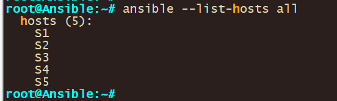

# Enhanced Ansible ad-hoc and Cisco IOS playbook Configuration Guide

This guide **builds** upon the initial Ansible and Cisco Switch configuration detailed in the previously provided guide (https://github.com/ WiredWizardry/Network/tree/master/04_Ansible_Basic_AdHoc). It aims to further enhance your network automation capabilities using Ansible playbooks. These playbooks are instrumental in retrieving vital network information such as ARP tables, MAC address tables, and device versions, thus simplifying network management and troubleshooting.

**The RAW Module in Ansible is particularly useful in environments where devices do not support Python**. This module allows for the execution of commands in their native form, without relying on the Ansible”s module facility. Therefore, even in the absence of Python, the RAW Module facilitates seamless interactions with the devices.

See Ansible official documentation for more information: <https://docs.ansible.com/ansible/latest/command_guide/intro_adhoc.html>

Through this lab, you will garner hands-on experience on the versatility of Ansible ad-hoc commands, especially when employing the RAW Module for devices devoid of Python support or Ansible playbooks.

We will use the following topology:


Here are some of the information on lab devices

| **Hostname** |                                              |
|--------------|----------------------------------------------|
|              |                                              |
| **Ansible**  | EVE-NG/GNS3 Network appliance @192.168.100.1 |
| **S1**       | Cisco Switch running vios_l2 @192.168.100.10 |
| **S2**       | Cisco Switch running vios_l2 @192.168.100.20 |
| **S3**       | Cisco Switch running vios_l2 @192.168.100.30 |
| **S4**       | Cisco Switch running vios_l2 @192.168.100.40 |
| **S5**       | Cisco Switch running vios_l2 @192.168.100.50 |

Prerequires:

-   EVE-NG/GNS3
-   Ansible appliance
-   Cisco images for EVE-NG/GNS3

**To execute Ansible ad-hoc commands, certain prerequisites are required:**

1.  **Ansible Installation on a Control Node**: This could be your personal computer or a dedicated server that serves as the communication bridge between Ansible and your network devices. In this lab, we utilize an EVE-NG/GNS3 provided automation appliance. The EVE-NG/GNS3 network container is equipped with widely utilized network automation tools such as Netmiko, NAPALM, Pyntc, and Ansible.
2.  **Python**: Given that Ansible is developed in Python, it”s imperative to have Python installed on the control node. However, as we are utilizing the Network appliance, this requirement is already satisfied.
3.  **Network Modules**: Ansible employs network modules (e.g., ios_command for Cisco IOS devices) to foster interactions with network devices.

Proceeding to create a sample lab with Ansible ad-hoc commands targeting Cisco devices, the primary steps encompass:

1.  **Ansible Installation on the Control Node**: This can be achieved via a package manager such as apt or yum, with the assumption that the control node setup is already in place.
2.  **Host File Setup**: Ansible necessitates an inventory file to keep track of the hosts constituting your network.
3.  **Router/Switch Connectivity Test**: Employing Ansible”s ping module, you can ascertain the connectivity to the Cisco router.
4.  **Command Execution on Router**: Utilize ad-hoc commands to execute commands on the router, particularly focusing on the raw module for devices without Ansible playbooks.
5.  **Output Filtering**: Ansible facilitates output filtering to extract the desired information.
6.  **Output Saving**: The ad-hoc commands also enable saving the output to a file for future reference or analysis.
7.  **Ansible use case**: The ad-hoc commands enable troubleshooting and saving of output to a file for future reference or analysis.

## Step 0: Configure Switch and Ansible

First, we have to configure the S1 for connectivity and to allow ssh. Use the below configs for S1

```
no ip domain name lookup
no logging console
cdp run
host S1
int Vlan1
 ip address 192.168.100.10 255.255.255.0
 no shut
username user privilege 15 secret password
line con 0
login local
line aux 0
line vty 0 4
 login local
 transport input all
 ip domain-name www.Test.home
crypto key generate rsa
1024
```

## 

**Let”s go through each of the commands listed:**

**no ip domain name lookup**: This command disables DNS lookup. Without this, any mistyped command in the console is interpreted as a hostname by the router, and it will attempt to resolve it via DNS, which can cause a delay.

**no logging console**: This command disables logging to the console. By default, the router sends all log messages to its console port. Therefore, disabling this can be helpful in not interrupting CLI access with log messages.

**cdp run**: This command enables the Cisco Discovery Protocol (CDP). CDP is a Cisco proprietary protocol used to discover Cisco devices in your network.

**host S1**: This command changes the hostname of the device to "S1".

**int vlan 1**: This command enters the configuration mode for VLAN 1.

**ip address 192.168.100.10 255.255.255.0**: This command assigns the IP address 192.168.100.10 with a subnet mask of 255.255.255.0 to VLAN 1.

**no shut**: This command brings up the VLAN interface if it”s administratively down. It”s equivalent to "enable this interface".

**username user privilege 15 secret password:** This command creates a user with the username "user", assigns it a privilege level of 15 (the highest level, equivalent to root or admin), and sets the password to "password". The keyword "secret" indicates that the password will be stored in a hashed format.

**line con 0**: This command enters line configuration mode for the console port.

**login local**: This command sets the login method to use the local user database for authentication. It”s used here for the console and VTY lines, meaning that the username and password set earlier will be used for console and remote logins.

**line vty 0 4**: This command enters line configuration mode for the first 5 VTY lines (0-4). VTY lines are used for Telnet and SSH access to the device.

**transport input all**: This command is also used under vty configuration mode. It allows all types of protocols (telnet, SSH, etc.) for remote access. However, for security purposes, it is recommended to allow only SSH (i.e., “transport input ssh”).

**ip domain-name www.Test.home**: This command sets the domain name of the device to www.Test.home. This is required for generating the RSA keys which are used by SSH for encryption and decryption.

**crypto key generate rsa**: This command initiates the process of generating RSA keys which are required for SSH. After entering this command, you will be prompted to enter the modulus size.

**1024**: This is the modulus size for the RSA keys. It represents the key length of 1024 bits. The larger the key size, the more secure the SSH connection, but at the cost of more processor overhead.

These commands together configure your Cisco IOS device for secure remote access, enabling you to manage your device without needing to be physically connected to it. It also disables some default settings like DNS lookup on mistyped commands and console logging.

Once configured Vlan1 should have a IP in place


-   Repeat this step for all of S2-5 assigning them different IP”s and hostname according to the IP”s listed above

**Configure Network connectivity to Ansible and verify connectivity.**

\-Next, we have to configure the Ansible control node and verify that we can reach our router/switch.-

1\. To statically configure a network right click the docker container and set the static ip: **192.168.100.1/24 in our case**

Note: If you downloaded ansible and installed it on ansible you make changes in /etc/network/interfaces to set the IP on a interface by opening the “/etc/network/interfaces” file using a text editor


**Save the changes**

2\. Restart/Start the network appliance and validate that your configs took by running the **ifconfig** command.


You should see the ip address you configured on the network adapter on the output.

1.  Validate network connectivity by pinging all the devices you want to reach

The command **ping 192.168.100.10** is used to test the network connectivity from the ansible control node to SW1 with the IP address 192.168.100.10 and so forth for the other switches/destination


**Configure Ansible**

1.  Validate that you can ssh into S1

    ssh [user@192.168.100.10](mailto:user@192.168.100.10)

    Configure host resolution.

2.  Add entries into the default host file for your devices using the below command: **nano /etc/hosts**

    

3.  Add in entries for your devices.

```
192.168.100.10 S1 
192.168.100.20 S2 
192.168.100.30 S3 
4
5
```

1.  Validate that host resolution is working by pinging device host entire name.

    

2.  Create inventory file for ansible. This will be used to tell Ansible what hosts to use.
-   Navigate to the parent directory with cd and verify your path with pwd

```
cd 
pwd
```


1.  Create new inventory file that will be used for hosts. An Ansible Inventory File is a cornerstone in Ansible”s architecture, functioning as a manifest that defines the nodes or hosts upon which tasks and playbooks will be executed.

```
Nano hosts
```

Configure your hostname in the file with group names

```
[ios]
S1
S2
S3
S4
S5
```

****

1.  Configure ansible configuration file to use your newly created host file.
-   Checking the ansible inventory you can see that although you configured hosts ansible is not able to see your host file
    1.  Use the below command to check ansible host file: **ansible –list-hosts all**

        

        1.  Create new local ansible configuration file with below command: **nano ansible.cfg**

            Use below configs for the ansible configuration file and then save the file.

```
[defaults]
inventory = ./hosts
host_key_checking = false
timeout = 5
```


Let”s go through each of the commands listed:

**- [defaults]:** This is the primary default section which includes a variety of settings you can adjust.

\- **hostfile = ./hosts –** This specifies the inventory file where Ansible will look to find the hosts that it can connect to. The “./hosts” suggests that the inventory file is named “hosts” and is located in the same directory as the “ansible.cfg” file.

\- **host_key_checking** = false: By default, Ansible checks the SSH key of the remote hosts during the first connection. This configuration disables that check. This is often used in environments where host keys aren”t yet known or can change, like in cloud or testing environments.

\- **timeout = 5**: This controls the number of seconds Ansible will wait for connections to hosts to complete. This is not the time limit for the entire task, but for the initial connection attempt. The default value is usually 10, but here it”s set to 5 seconds.

1.  Verify ansible is using your created host file.

Checking the ansible host file you can see that ansible is now able to see the hosts in your host file due to using the local ansible configuration file.

Use the command below: **ansible –list-hosts all**



## 

## 

## Step 1: Retrieving ARP Table with Ansible

The first step involves creating an Ansible playbook to retrieve the ARP (Address Resolution Protocol) table from Cisco switches. The ARP table is crucial as it maps IP addresses to MAC addresses, helping in network troubleshooting and understanding device connections on the network.

1.  **Creating the Playbook (getarp1.yml)**

    Open a text editor (nano, in this case) on the control node to create the playbook:

```
nano getarp1.yml
```

The content of the playbook should be as follows:

```
---
- name: Retrieve ARP table
  hosts: all
  gather_facts: false

  tasks:
    - name: show arp
      raw: "show arp"
      register: print_output

    - debug: var=print_output.stdout_lines
```

**Explanation**:

**hosts: all:** Targets all hosts specified in the Ansible inventory.

**gather_facts: false:** Disables gathering system facts to speed up the execution.

**tasks**: Defines the operations to be performed.

**raw: "show arp":** Sends the show arp command directly to the Cisco switch CLI. This command displays the ARP table.

**register: print_output:** Stores the output of the command in the variable print_output.

**debug: var=print_output.stdout_lines:** Prints the output to the console for inspection.

1.  **Executing the Playbook**

    Run the playbook using the following command:

```
ansible-playbook getarp1.yml -u [username] -k
```

Replace [username] with the appropriate SSH username for the switches. The -k option prompts for the SSH password.

1.  **Optional: Filtering Output**

    In scenarios where specific entries are needed, use grep to filter the output:

    **To filter by MAC address:**

```
ansible-playbook getarp1.yml -u [username] -k | grep 'ok:\|4700'
```

To filter by IP address:

```
ansible-playbook getarp1.yml -u [username] -k | grep 'ok:\|100.51'
```

These commands extract lines containing the 'ok:' status or the specified MAC/IP addresses.

This playbook is a fundamental tool for network engineers, allowing quick retrieval of ARP tables from multiple devices in a network. It not only saves time but also ensures accuracy by automating a task that would otherwise be manual and prone to human error. By integrating such playbooks into regular network operations, network engineers can significantly enhance efficiency and responsiveness in managing and troubleshooting network issues.

## Step 2: Getting MAC Address Table with Ansible

The second step involves using an Ansible playbook to extract the MAC (Media Access Control) address table from Cisco switches. This MAC address table is vital for network management as it associates each MAC address with its corresponding port on the switch, aiding in network monitoring and security enforcement.

**1.** **Creating the Playbook (getmacaddress1.yml)**

Start by opening a text editor on the control node:

```
nano getmacaddress1.yml
```

The content of the playbook should be as follows:

```
---
- name: Get MAC address table information
  hosts: all
  gather_facts: false

  tasks:
    - name: show MAC address table
      raw: "show mac address-table"
      register: print_output

    - debug: var=print_output.stdout_lines
```

**Explanation:**

**hosts: all**: This specifies that the playbook should run on all hosts listed in the Ansible inventory.

**gather_facts: false:** This disables the default gathering of system facts to expedite the playbook execution.

**tasks:** Defines the sequence of tasks to be executed.

**raw: "show mac address-table":** Executes the show mac address-table command on the switch. This command is used to display the MAC address table of the switch.

**register: print_output:** Captures the output of the command and stores it in the print_output variable.

**debug: var=print_output.stdout_lines:** Outputs the contents of print_output to the console for review.

**2. Executing the Playbook**

To run the playbook, use the following command:

```
ansible-playbook getmacaddress1.yml -u [username] -k
```

Replace [username] with the actual SSH username for the switches. The -k flag prompts for the SSH password.

**3. Optional: Filtering Output**

If you need to focus on specific MAC addresses, you can filter the output:

**Filter by a specific MAC address:**

```
ansible-playbook getmacaddress1.yml -u [username] -k | grep 'ok:\|4700'
```

This command filters the playbook's output, showing only lines containing 'ok:' (indicating successful task execution) or the specified MAC address.

This playbook provides a streamlined approach to gather MAC address table information across multiple network devices. It's particularly useful in environments where regular monitoring of MAC address entries is essential for security, compliance, and network management. Automating this process with Ansible enhances efficiency, reduces the likelihood of human error, and contributes to more effective network administration practices.

## Step 3: Displaying Version and Interface Information with Ansible

The objective of this step is to create and execute an Ansible playbook, named shver1.yml, that retrieves both the version and interface information from Cisco switches. This information is critical for verifying the software version for compliance and security purposes, as well as for checking the status of network interfaces.

**1.Creating the Playbook (shver1.yml)**

Start by opening a text editor on the control node:

```
nano shver1.yml
```

The content of the playbook should be as follows:

```
---
- name: Show version and interface information
  hosts: all
  gather_facts: false
  connection: local

  tasks:
    - name: Run multiple commands on remote nodes
      ios_command:
        commands:
          - show version
          - show ip int brief
      register: print_output

    - debug: var=print_output.stdout_lines
```

**Explanation**:

**hosts: all:** Targets all hosts defined in the Ansible inventory.

**gather_facts: false:** Disables automatic fact gathering to speed up execution.

**connection: local:** Runs the playbook on the local machine.

**tasks:** Lists the operations to be performed.

**ios_command:** A module tailored for Cisco IOS devices, used to send commands to them.

**commands:** A list of commands to be executed on the switches. Here, show version displays software version information, and show ip int brief provides a summary of the interface statuses.

**register: print_output**: Captures the output of the commands in the variable print_output.

**debug: var=print_output.stdout_lines:** Displays the captured output for verification and analysis.

**2. Executing the Playbook**

To run the playbook, use the following command:

```
ansible-playbook shver1.yml -u [username] -k
```

Replace [username] with the appropriate SSH username for the switches. The -k option will prompt for the SSH password.

This playbook serves as an essential tool for network administrators, allowing for quick and efficient retrieval of version and interface information from Cisco switches. The ability to execute multiple commands in a single playbook and view their outputs can greatly aid in routine network checks, compliance audits, and troubleshooting tasks. Automation via Ansible in this manner not only saves time but also ensures consistency and accuracy in network management operations.

\*\*  
\*\*

## Step 4: Backup and Save Output to File with Ansible

The purpose of this step is to develop an Ansible playbook (getver2.yml) that executes the show version command on Cisco switches, retrieves the output, and then saves this information to a file. This task is vital for maintaining records of the software version of network devices, which can be crucial for compliance, auditing, and troubleshooting. Input the below command to retrieve the output of the S1 switch using ansible.

1.  **Creating the Playbook (getver2.yml)**

Open a text editor on the control node:

```
nano getver2.yml
```

Then, input the following content into the playbook:

```
---
- name: Backup show version command output
  hosts: all
  gather_facts: false
  connection: local

  tasks:
    - name: Run show version command
      ios_command:
        commands:
          - show version
      register: print_output

    - debug: var=print_output.stdout_lines

    - name: Save output to a file
      copy: content="{{ print_output.stdout[0] }}" dest="./output/{{ inventory_hostname }}.txt"
```

**Explanation**:

**hosts: all:** Indicates that the playbook will be executed on all hosts in the Ansible inventory.

**gather_facts: false:** Disables the default fact-gathering to speed up the playbook.

**connection: local:** Specifies that the playbook runs on the local machine.

**tasks**: Lists the tasks to be executed.

**ios_command:** An Ansible module designed for Cisco IOS devices. It sends specified commands to the devices.

**commands**: The actual commands to be executed on the switches. show version provides detailed version information of the Cisco IOS software.

**register: print_output:** Saves the output of the command in the print_output variable.

**debug: var=print_output.stdout_lines:** Displays the output for review.

**copy:** An Ansible module used to save the output to a file.

**content:** Specifies the content to be saved, in this case, the first line of the stdout from print_output.

**dest:** The destination path and filename for the saved file, dynamically using the host name for organization.

**2. Preparing Output Directory**

Before running the playbook, create a directory to store the output files:

```
mkdir output
```

**3. Executing the Playbook**

Run the playbook with the following command:

```
ansible-playbook getver2.yml -u [username] -k
```

Replace [username] with the SSH username for the switches. The -k flag is used to prompt for the SSH password.

This playbook is an efficient tool for automated backup and documentation of Cisco switch software versions. By saving the output of show version to individual files named after each switch, it facilitates easy tracking of software versions and aids in historical record-keeping. This approach is especially useful for compliance with IT policies, auditing purposes, and maintaining a robust change management process in network environments.
