## Palo Alto BGP Over GRE Lab Guide

### Use Case

This lab focuses on the advanced networking scenario of implementing Border Gateway Protocol (BGP) over a Generic Routing Encapsulation (GRE) tunnel using a Palo Alto firewall. The objective is to securely route traffic between disparate networks while gaining the benefits of dynamic routing via BGP.

### Prerequisites

-   GNS3 / *EVE*-*NG environment*
-   Palo Alto firewall images
-   Cisco/ Tunnel termination images

### Required Components

1.  **Network devices preconfigured; This lab assumes that you have bgp configured and you can test the flow of traffic through the gre tunnel.**
2.  **Palo Alto Firewall**: The network device where BGP and GRE configurations will be implemented.

### Key Steps

1.  **Network Topology**: Establish the network topology involving the Palo Alto firewall.
2.  **Initial Configuration**: Set up the basic configurations on the Palo Alto firewall.
3.  **Create GRE tunnel and validate reachability**: Implement the GRE tunnel on the Palo Alto firewall and validate the tunnel is up.
4.  **BGP Over GRE tunnel and validate reachability**: Manually configure the BGP settings on the Palo Alto firewall. Then validate connectivity between the devices involved in the lab.
5.  **Configure Route-map and prefix list for route filtering on Palo**: Configure Route-map and prefix list for route control and to prevent asymmetrical routing.
6.  **Configure Traffic to go over BGP-GRE tunnel**: Integrate the BGP and GRE configurations to facilitate dynamic routing over the tunnel.

**Output Filtering and Logging**: Utilize built-in Palo Alto/ EVEN-NG Wireshark features for filtering and logging relevant data for auditing.

### Lab Topology

A detailed topology will be outlined in the lab guide, indicating the network layout and connections between the control node and the Palo Alto firewall.

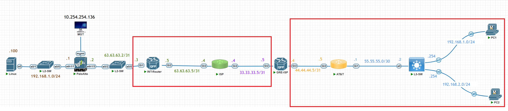

\*please note that in highlighted in red we don’t spend much time on the configuration its up to you to decide to build this out the same

### Lab Devices Information

| Hostname   | Description                                                                      | IP                                                    | Protocol |
|------------|----------------------------------------------------------------------------------|-------------------------------------------------------|----------|
| Palo Alto  | Palo Alto firewall where our GRE tunnel will be configured alongside BGP configs | 192.168.1.0/24 63.63.63.2/31 2.100.20.66/31 0.0.0.0/0 | BGP      |
|  L2-SW     | I86bi_linux_l2 Cisco basic L2 switch                                             | L2                                                    |          |
| Int-Router | Cisco CSR1000V                                                                   | 63.63.63.3/31 63.63.63.5/31                           | BPG      |
| ISP        | Cisco CSR1000V                                                                   | 33.33.33.4/31 63.63.63.4/31                           | BGP      |
| GRE-ISP    | Cisco CSR1000V                                                                   | 33.33.33.5/31 44.44.44.4/31 2.100.20.67/31            | BGP      |
| AT&T       | Cisco CSR1000V                                                                   | 55.55.55.1/31 44.44.44.5/31                           | BGP      |
| L3-SW      | Pfsense-2.6.0 Using wan interface and natting backend as LAN interface           | 0.0.0.0                                               |          |

## Step 0: Network configurations

| INT-ROUTER | Config t Hostname INT-ROUTER no logging monitor  no logging console  no service config no boot network  interface gi1  description connection to FW .2  ip address 63.63.63.3 255.255.255.254  no shut  interface gi2  description out to isp .4  ip address 63.63.63.5 255.255.255.254  no shut   router bgp 65001  bgp log-neighbor-changes  neighbor 63.63.63.4 Remote-as 65000  !  address-family ipv4  bgp dampening  neighbor 63.63.63.4 activate                                                                   |
|------------|---------------------------------------------------------------------------------------------------------------------------------------------------------------------------------------------------------------------------------------------------------------------------------------------------------------------------------------------------------------------------------------------------------------------------------------------------------------------------------------------------------------------------|
| ISP        | Config t Hostname ISP no logging monitor  no logging console  no service config no boot network  interface gi3  description connection to FW .5  ip address 33.33.33.4 255.255.255.254  no shut  interface gi2  description out to INT-ROUTER .5  ip address 63.63.63.4 255.255.255.254  no shut   router bgp 65000  bgp log-neighbor-changes  neighbor 63.63.63.5 Remote-as 65001  neighbor 33.33.33.5 Remote-as 6600  !  address-family ipv4  bgp dampening  neighbor 63.63.63.5 activate  neighbor 33.33.33.5 activate |

## 

| **ISP-GRE** | CONFIG T Hostname ISP-GRE no logging monitor  no logging console  no service config no boot network  interface gi2  description connection to ISP .4  ip address 33.33.33.5 255.255.255.254  no shut  interface gi3  description out to ATT .5  ip address 44.44.44.4 255.255.255.254  no shut   no router bgp 66000 router bgp 6600  bgp log-neighbor-changes  neighbor 33.33.33.4 remote-as 65000  neighbor 44.44.44.5 remote-as 60000  !  address-family ipv4  bgp dampening  network 33.33.33.4 mask 255.255.255.254  network 44.44.44.4 mask 255.255.255.254  neighbor 33.33.33.4 activate  neighbor 44.44.44.5 activate  exit-address-family  interface Tunnel0  ip address 2.100.20.67 255.255.255.254  tunnel source GigabitEthernet2  tunnel destination 63.63.63.2  no shutdown    router bgp 6600  neighbor 2.100.20.66 remote-as 65001  address-family ipv4  neighbor 2.100.20.66 activate  exit-address-family    ! Create the Route-Map to deny specific network route-map DENY_55_55_55_0 permit 10  match ip address prefix-list DENY_PREFIX  set metric 0 ! Create the prefix list that matches the network 55.55.55.0/30 ip prefix-list DENY_PREFIX seq 5 deny 55.55.55.0/30 ip prefix-list DENY_PREFIX seq 10 permit 0.0.0.0/0 le 32  ! Apply the Route-Map to the BGP neighbors router bgp 6600  address-family ipv4  neighbor 33.33.33.4 route-map DENY_55_55_55_0 out  neighbor 44.44.44.5 route-map DENY_55_55_55_0 out |
|-------------|------------------------------------------------------------------------------------------------------------------------------------------------------------------------------------------------------------------------------------------------------------------------------------------------------------------------------------------------------------------------------------------------------------------------------------------------------------------------------------------------------------------------------------------------------------------------------------------------------------------------------------------------------------------------------------------------------------------------------------------------------------------------------------------------------------------------------------------------------------------------------------------------------------------------------------------------------------------------------------------------------------------------------------------------------------------------------------------------------------------------------------------------------------------------------------------------------------------------------------------------------------------------------------------------------------------------------------------------------------------------------------------------------------------------------------------------|

| AT&T | Config t Hostname AT&T no logging monitor  no logging console  no service config no boot network  interface gi1  description Local connection  ip address 55.55.55.1 255.255.255.252  no shut  interface gi2  description out to Akamia .4  ip address 44.44.44.5 255.255.255.254  no shut   router bgp 60000  bgp log-neighbor-changes  no neighbor 44.44.44.4 Remote-as 66000  neighbor 44.44.44.4 Remote-as 6600 |
|------|---------------------------------------------------------------------------------------------------------------------------------------------------------------------------------------------------------------------------------------------------------------------------------------------------------------------------------------------------------------------------------------------------------------------|

## Step 1: Configure Palo Alto

#### First, we have to configure the firewall for GUI access. Use the below command and make sure that the address you use is part of your network;

```
set deviceconfig system ip-address 10.254.254.190 netmask 255.255.255.0 default-gateway 10.254.254.1 type static
```

## 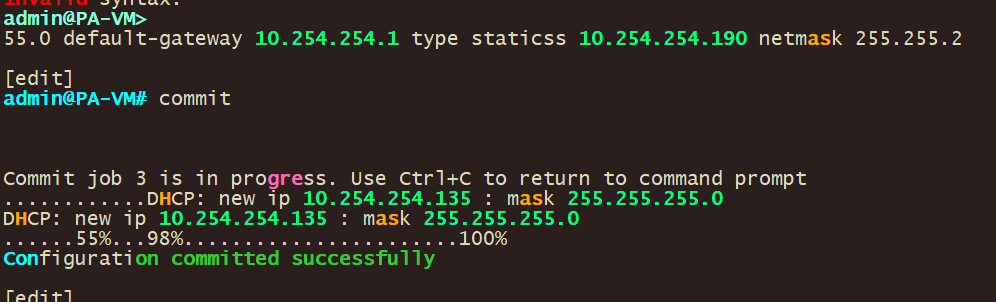

Visit your palo alto through the GUI using https (use the ip you just configured)

https://10.254.254.190


### Configure external facing interface on the palo alto interface using below configs

Navigate to Network and configure your interface

| ethernet1/3                   |                                                               |
|-------------------------------|---------------------------------------------------------------|
| Interface type                | Layer 3                                                       |
| Virtual router                | Configure a new one or use default                            |
| Security Zone                 | External                                                      |
| Ipv4                          | 63.63.63.2/31                                                 |
| Advanced-\>Management Profile | Configure a profile if you want to test reachability via ping |

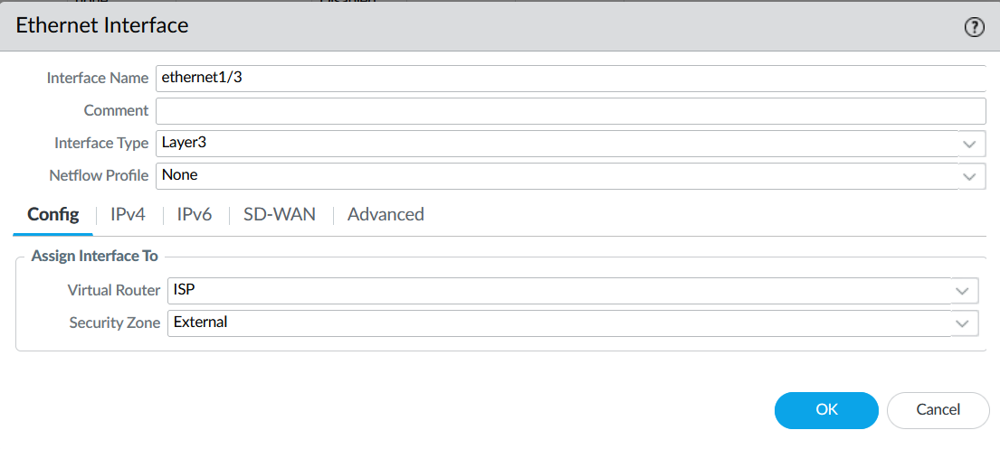

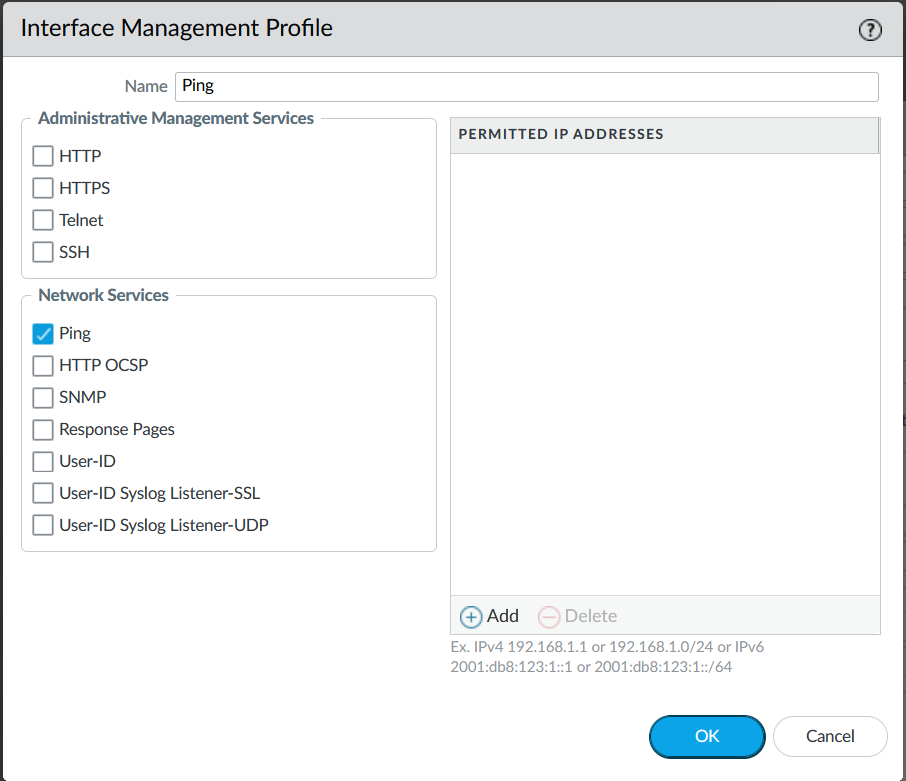

**Click [Ok] and commit changes**

### Validate reachability

Validate reachability from the public interface of your Router to the external facing interface on the palo alto that was just created in step B (If a interface management profile is configured with ping you will be able to ping the palo alto interface thus validating connectivity.)

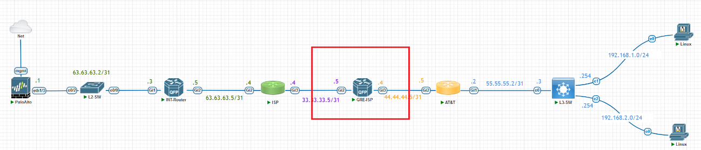Note: The ping is being sourced from the GRE-ISP in my case

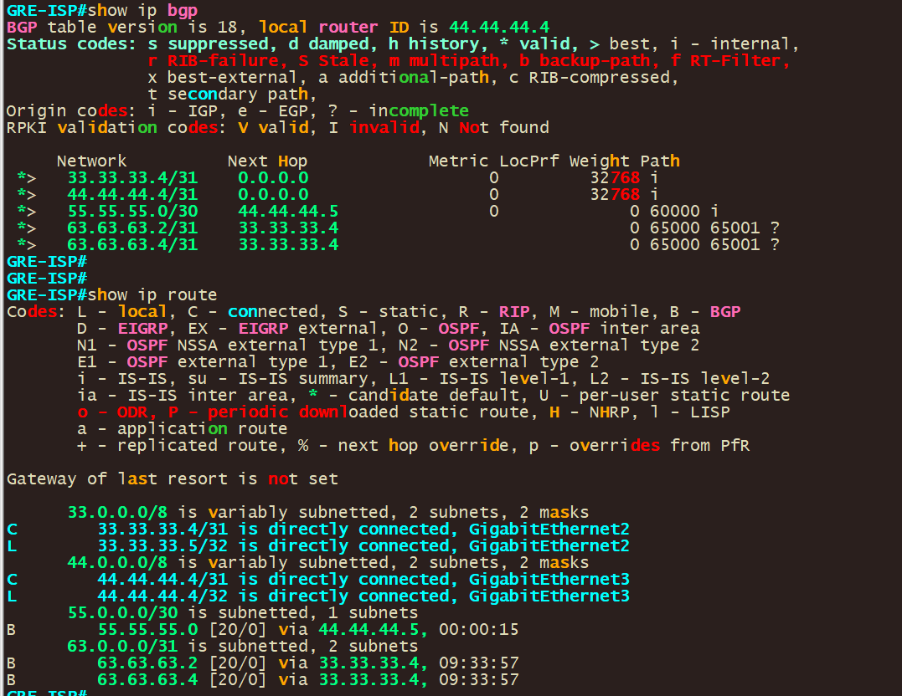

Validate that you have the route to 63.63.63.2/31 in your routing table. If you do you should be able to ping the external facing interface

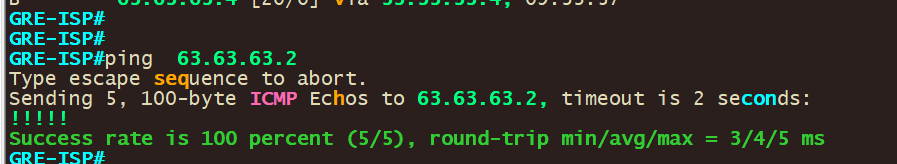

### Configure tunnel interface

Navigate to Network -\> Interface -\> Tunnel

| Tunnel                        |                                                               |
|-------------------------------|---------------------------------------------------------------|
| Interface Name:               | 1                                                             |
| Comment:                      | Connect GRE                                                   |
| Virtual Router:               | Your VR                                                       |
| Security Zone:                | UNTRUST                                                       |
| IPv4                          | 2.100.20.66/31                                                |
| Advanced-\>Management Profile | Configure a profile if you want to test reachability via ping |

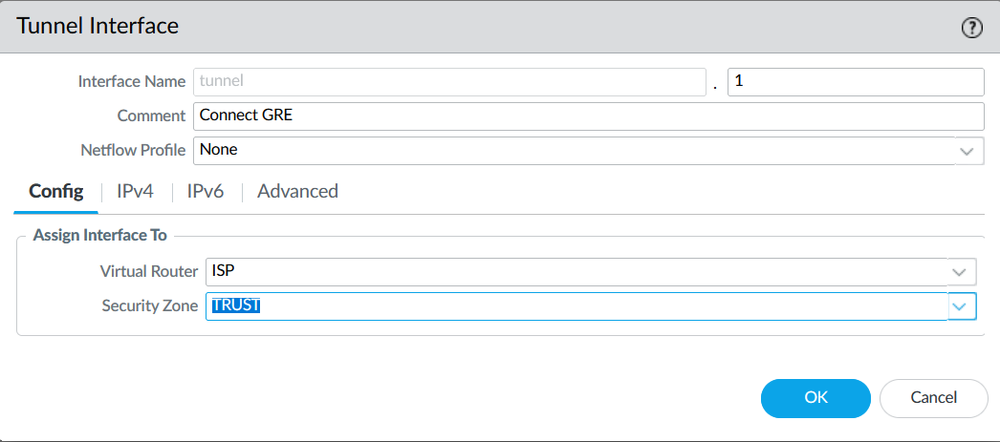

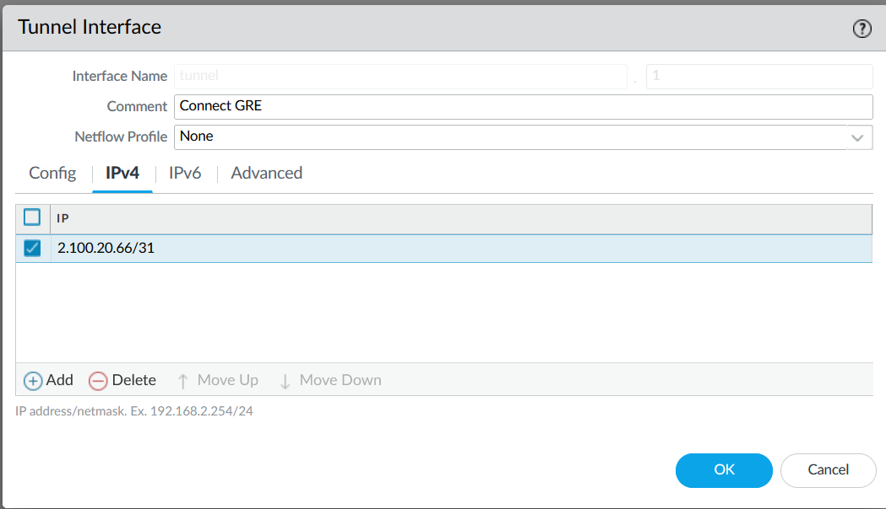

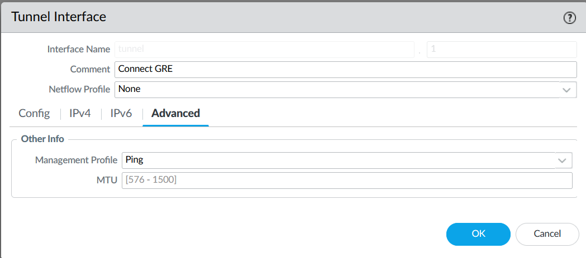

**Click [Ok] than commit your changes**

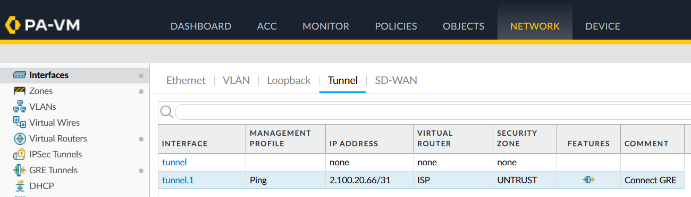

# Step 2: Create GRE tunnel and validate reachability

1.  Navigate to Network -\> GRE Tunnels and Add a new tunnel with below configs

| Name             | Test-Tun1                                                                                                                                                    |
|------------------|--------------------------------------------------------------------------------------------------------------------------------------------------------------|
| Interface        | ethernet1/3                                                                                                                                                  |
| IP               | 63.63.63.2/31                                                                                                                                                |
| Peer Address     | 33.33.33.5 Note; this is the public facing ip of your peer not the tunnel. The tunnel peer ip was configured in the tunnel setting done pervious in step 1.B |
| Tunnel Interface | tunnel.1                                                                                                                                                     |
| Keep Alive       | Configure keep alive to make sure your tunnel stays up.                                                                                                      |

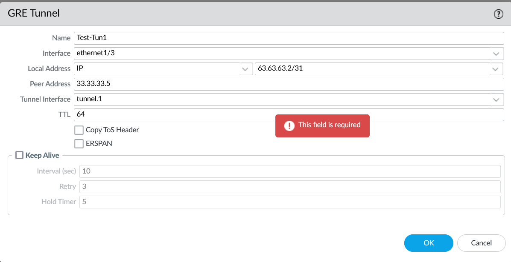

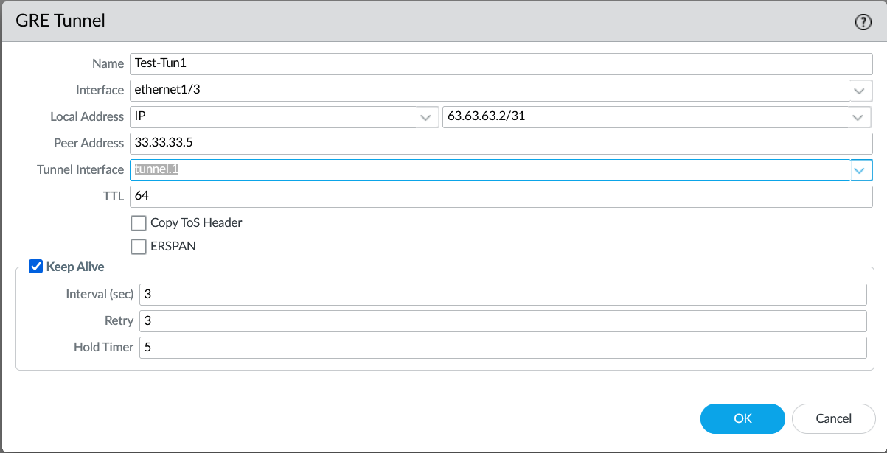

**Click [Ok] than commit your changes**

### Validate tunnel reachability

-   You should be able to ping the tunnel destination.
-   Your tunnel interface should show up.

    Use below validation commands to make sure that your tunnel is configured that the routing table looks correct.

| **show routing route**                       | Display the routing table                                                                               |
|----------------------------------------------|---------------------------------------------------------------------------------------------------------|
| **ping source 2.100.20.66 host 2.100.20.67** | Used to perform a ping test from the tunnel interface IP address to tunnel peer destination Ip address. |
| **show interface tunnel**                    | Show the status of configured tunnel                                                                    |

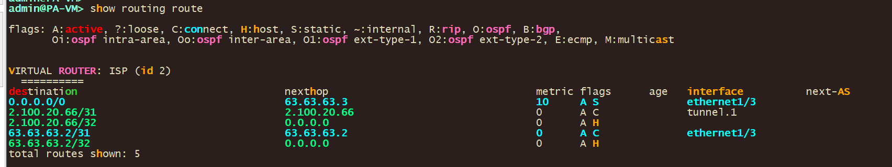

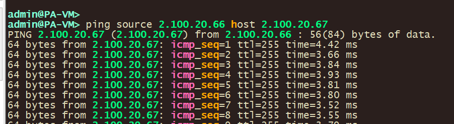

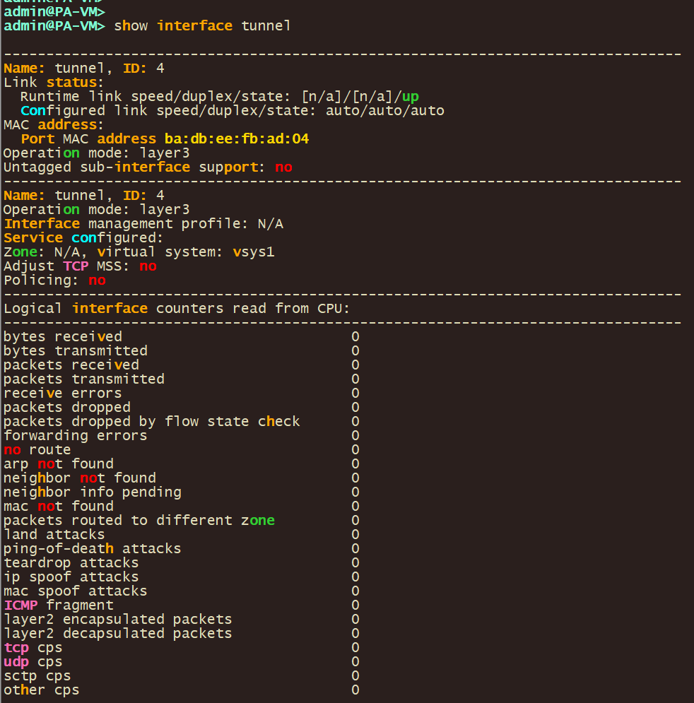

# Step 3: BGP Over GRE tunnel and validate reachability

1.  Navigate to Network -\> Virtual Router -\> and Click on your Virtual Router
    1.  Under Virtual Router navigate to BGP and use below configs

| Enable                        | Make sure this is checked                                                                                                                        |
|-------------------------------|--------------------------------------------------------------------------------------------------------------------------------------------------|
| Router ID                     | 63.63.63.2                                                                                                                                       |
| AS Number                     | 65001                                                                                                                                            |
| AUTH PROFILES                 | Use if you have bgp password                                                                                                                     |
| BGP -\> Peer Group            | Peer Group Click [Add] And configure new bgp peer                                                                                                |
| VR- BGP -\> Peer Group        | Name: GRE-Tunnel1 Click [Add] And configure new bgp peer                                                                                         |
| VR- BGP -\> Peer Group – Peer | Name: GRE-ISP-TUN0 Peer AS: 6600 Interface: tunnel.1 Peer Address: 2.100.20.67 -change other settings as wanted otherwise  click [OK] click [OK] |

Note: For now, we are just bringing up BGP. Note: By default, ASN format is set to 2-byte(AS numbers range from 1 to 65535), if you need to switch to 4-byte (AS number ranging from 65536 to 4294967295 **make sure that 4 Byte is checked**

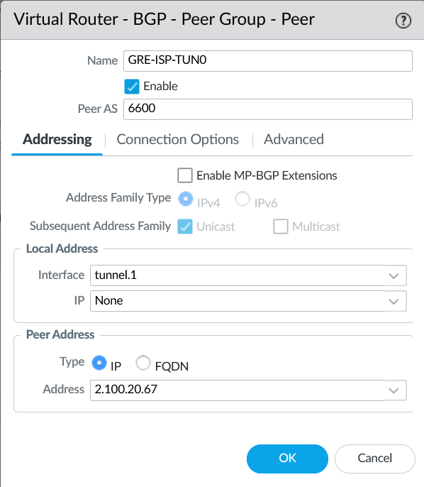

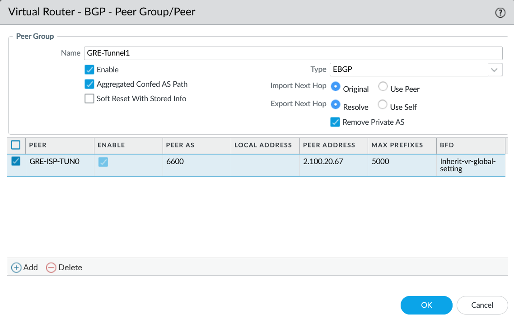

**Click [Ok] than commit your changes**

**  
**

### Configure BGP on the GRE-ISP and validate that BGP comes up

Use below configs

| router bgp 6600  neighbor 2.100.20.66 remote-as 65001  address-family ipv4  neighbor 2.100.20.66 activate  exit-address-family |
|--------------------------------------------------------------------------------------------------------------------------------|

After which you should see that bgp came up

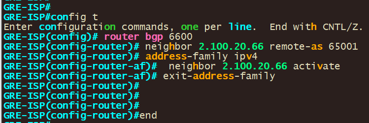

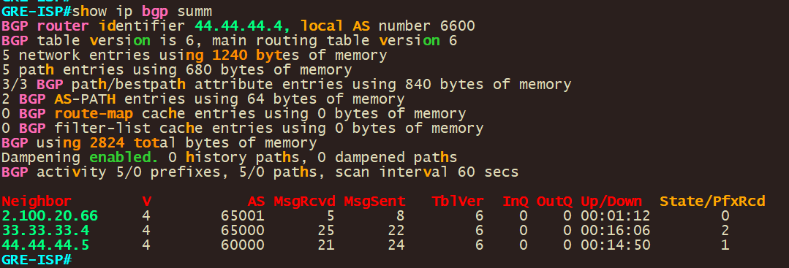

### To Validate on the palo alto Navigate to Network -\> Virtual Routers

-   **Virtual Routers**: Click on "Virtual Routers," then select the virtual router where your BGP configuration resides.
-   **More Runtime Stats**: Click on "More Runtime Stats" at the bottom of the page.
-   **BGP**: In the "More Runtime Stats" window, navigate to "BGP" and then "Peer."
-   **Check Status**: You will see the status of all your BGP peers listed there. Look for the "State" column to check if the peer is in an "Established" state.

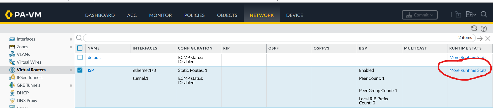

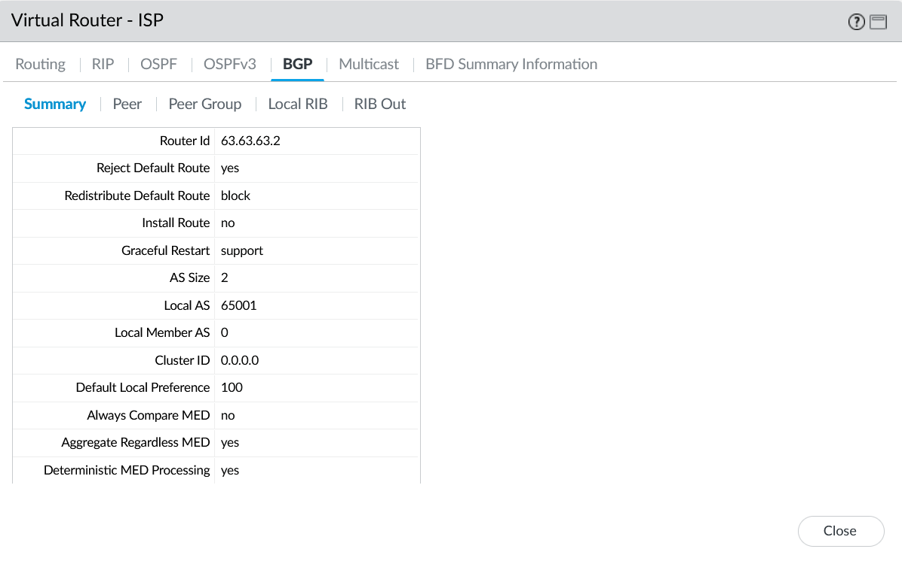

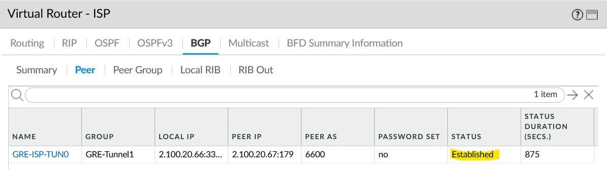

## Step 4: Configure Route-map and prefix list for route filtering on Palo

When under **More Runtime Stats Local RIB on your Virtual Router**

You can see routes that are in your RIB but these same routes are not in your routing table. This is because The "**Install Route**" option under the BGP settings on a Palo Alto firewall controls whether the routes learned from a BGP peer are actually installed in the firewall's routing table. This setting provides granular control over the firewall's routing behavior when it's participating in a BGP session. In our case we left the option disabled thus the firewall still learns routes from the BGP peer, but it does not install them in its routing table in keeps them in the Local RIB instead. Essentially, the firewall becomes a BGP route reflector for these routes but does not use them for its own traffic forwarding decisions.

We do not want to enable this option since we want Granular control over which routes are used for traffic forwarding. We will use a Route-map and prefix to choose which routes we want.

Methods to control Route installation

| **Route Maps**:                    | Use route maps to set conditions for installing specific routes. Route maps can match routes based on attributes like AS Path, Prefix, or Communities and then set specific actions. |
|------------------------------------|--------------------------------------------------------------------------------------------------------------------------------------------------------------------------------------|
| **Prefix Lists**:                  | Define a prefix list to match specific network prefixes and use them in conjunction with route maps.                                                                                 |
| **AS Path Filters**                | Use AS path filters to control route installation based on the AS path attribute.                                                                                                    |
| **Policy-Based Forwarding (PBF)**: | While not a BGP feature, PBF allows you to define custom forwarding rules based on source and destination addresses, applications, or services.                                      |
| **Static Routes**:                 | Manually install specific routes into the routing table. This is the most straightforward but least dynamic option.                                                                  |

Local RIB (in our case we only want the 55.55.55.0/31 Subnet

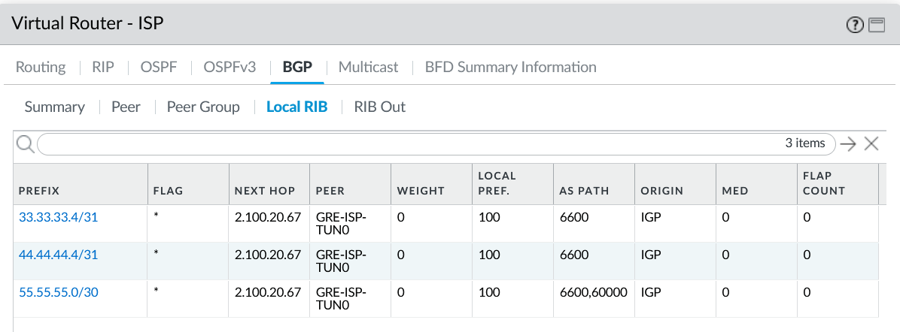

### Configure Import Rules for Inbound Routes (Equivalent to Route Maps)

Go to **Network** \> **Virtual Routers** (Select the Virtual Router that holds your BGP configuration.)

Navigate to the **BGP** section find **Import**

-   Here, you can add rules to control the routes that are imported into your routing table from this BGP peer.
    -   You can match on various attributes like Prefix, Next Hop, AS Path, Communities, etc.
    -   You can then decide to allow or deny these routes.

| VR -\> BGP - Import                 | Click on [Add]                             |
|-------------------------------------|--------------------------------------------|
| VR -\> BGP – Import Rule            | Rules: GRE-TUN1-ALLOW Used by: GRE-Tunnel1 |
| VR -\> BGP –\> Import Rule - Match  | Address Prefix: 55.55.55.0/31              |
| VR -\> BGP –\> Import Rule – Action | [Allow]                                    |

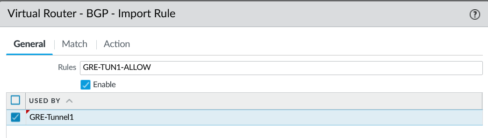

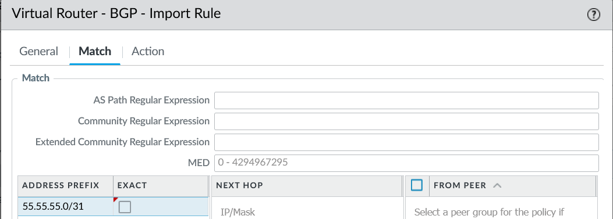

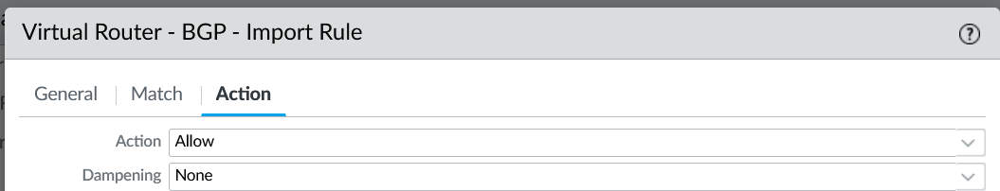

**Click [Ok] than commit your changes**

**  
**

### Valiate that the Route-map took place and only the subnet you want is now in your RIP

Go to **Network** \> **Virtual Routers** (Select the Virtual Router that holds your BGP configs)

**More Runtime Stats BGP -\>Local RIB on your Virtual Router**

If your Route-map was configured correct than you should have only the approved subnet in your local RIB (There is a implicit deny for everything else)

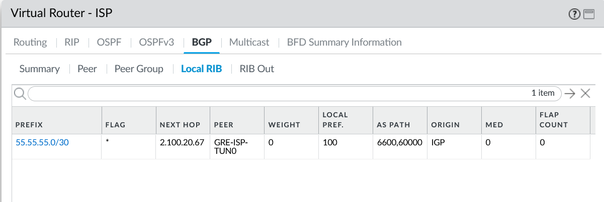

Click on [Close]

Go to **Network** \> **Virtual Routers** (Select the Virtual Router that holds your BGP configuration.) Navigate to the **BGP** section and check **[Install Route]**

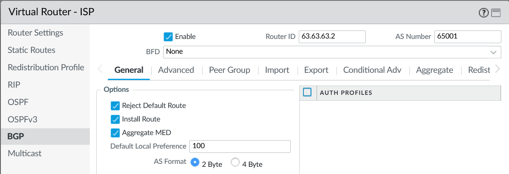

**Click [Ok] than commit your changes**

### Validate that your route is in the local table after your commit

Go to **Network** \> **Virtual Routers** (Select the Virtual Router that holds your BGP configs)

**More Runtime Stats**

If everything was configured correctly than your route should appear in the Routing table.

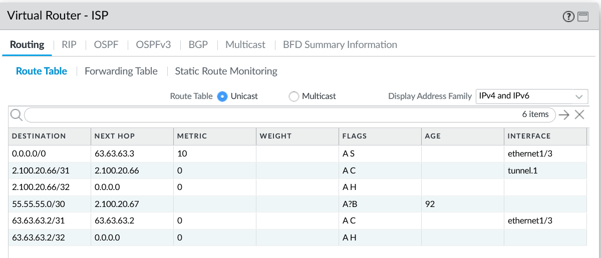

## Step 5: Configure Traffic to go over BGP-GRE tunnel

On GRE-ISP we will make sure that 55.55.55.0/30 is only being sent to the GRE TUNNEL BGP PEER

Use below configs

| ! Create the Route-Map to deny specific network route-map DENY_55_55_55_0 permit 10  match ip address prefix-list DENY_PREFIX  ! Create the prefix list that matches the network 55.55.55.0/30 ip prefix-list DENY_PREFIX seq 5 deny 55.55.55.0/30 ip prefix-list DENY_PREFIX seq 10 permit 0.0.0.0/0 le 32  ! Apply the Route-Map to the BGP neighbors router bgp 6600  address-family ipv4  neighbor 33.33.33.4 route-map DENY_55_55_55_0 out  neighbor 44.44.44.5 route-map DENY_55_55_55_0 out  |
|-----------------------------------------------------------------------------------------------------------------------------------------------------------------------------------------------------------------------------------------------------------------------------------------------------------------------------------------------------------------------------------------------------------------------------------------------------------------------------------------------------|

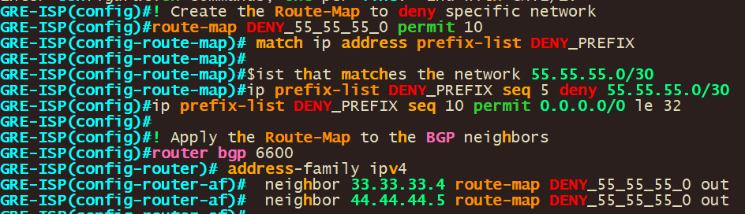

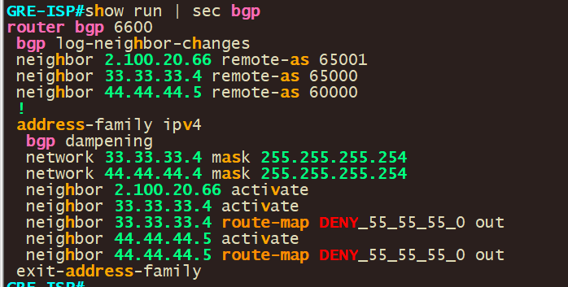

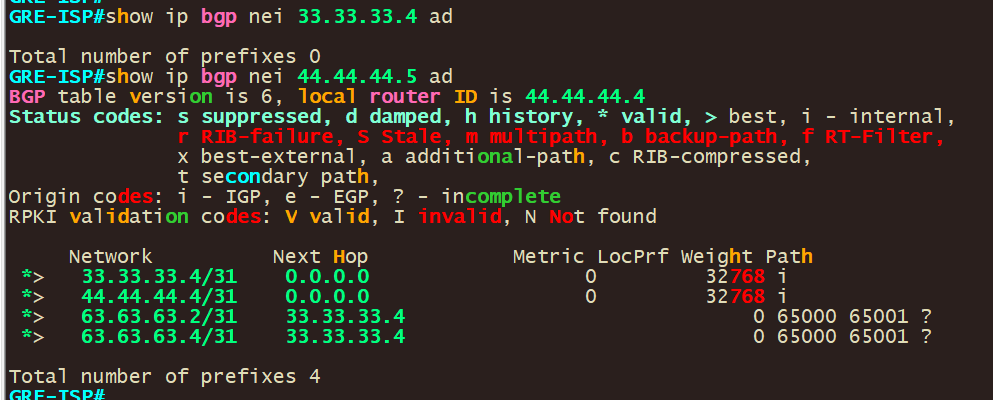

### Configure GRE-ISP to Advertise its Tunnel subnet

We can have GRE-ISP advertise a /24 subnet that contains the tunnel interface using a aggregate route.

Use below configs

|   router bgp 6600  address-family ipv4 aggregate-address 2.100.20.0 255.255.255.0 summary-only  network 2.100.20.66 mask 255.255.255.254  |
|-------------------------------------------------------------------------------------------------------------------------------------------|

In BGP, the aggregate-address command is used to create a summary route that is advertised to other BGP peers. For the aggregate address to be generated and advertised, at least one more specific route that falls within the aggregate range must be present in the BGP table, not just the local routing table.

Once the aggregate /24 has been added you should see the /24 in you routing table as such.

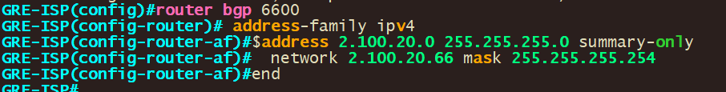

2.100.20.0/24 is now in the routing table and is advertised to your BGP peers

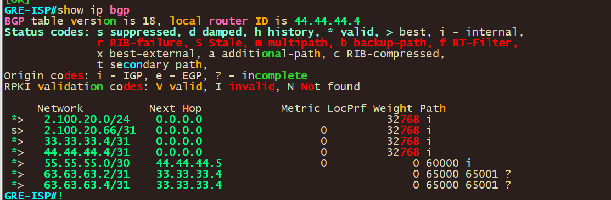

Validate reachability to palo alto tunnel interface thus validating that traffic is fully working and flowing through the GRE Tunnel.

Ping from PC1(192.168.1.102) to 2.100.20.66(palo alto tunnel interface)

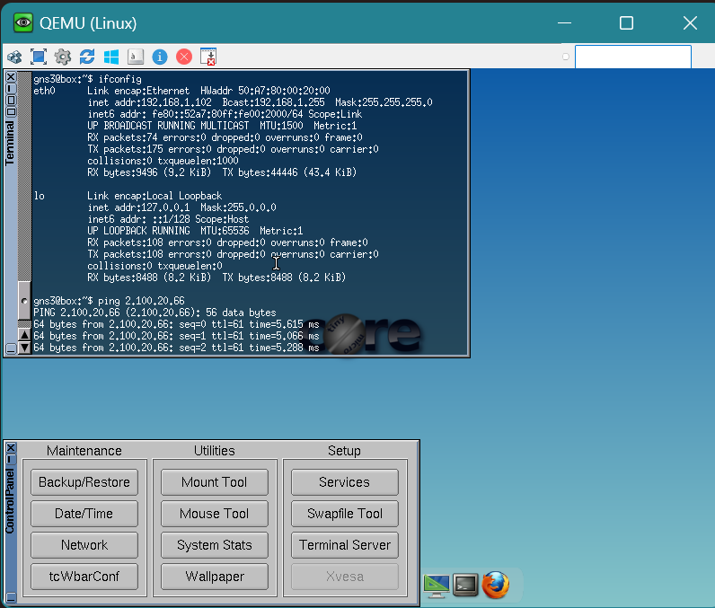

Ping from PC2(192.168.2.102) to 2.100.20.66(palo alto tunnel interface)

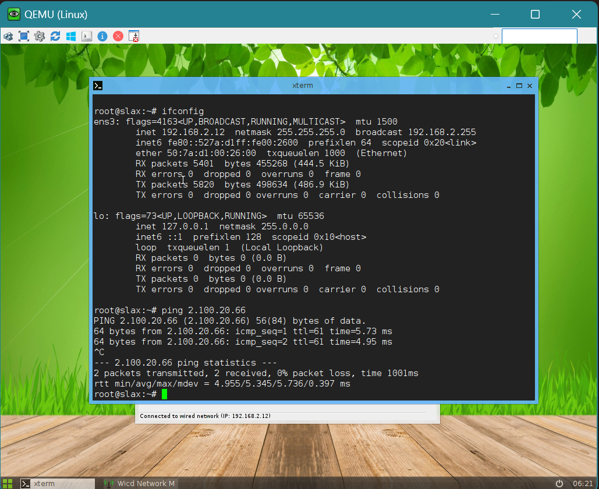

You can configure other interfaces and export/redistribute them into bgp advertising them over the BGP-GRE tunnel or use NAT so that you stay within the /24 range but that is outside of the scope of this lab. Since this lab main point was creating the tunnel, creating BGP over the tunnel and advertising subnets over the BGP-GRE tunnel.
