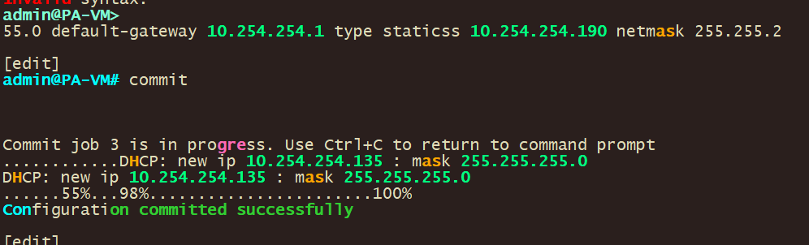

# Global Protect Basic lab use case

This lab activity delves into the use case of ansible ad-hoc commands using the RAW Module for connecting to devices that don’t have python enabled/supported. Ansible is an open-source automation tool that can manage the configuration of network devices. Ad-hoc commands in Ansible are commands that can be run individually to perform quick tasks, instead of executing playbooks which contain a series of tasks.

In order to run Ansible ad-hoc commands, a couple of things are needed:

1\. Ansible installed on a control node - This can be your personal computer or a dedicated server. This control node communicates with your network devices. In this lab we use GNS3 provided automation appliance. The GNS3 network container provides the popular tools used for network automation: Netmiko, NAPALM, Pyntc, and Ansible.

2\. Python - Ansible is written in Python and requires Python on the control node. (Again because we are using the Network appliance we don’t have to worry about this)

3\. Network modules - Ansible uses network modules (like ios_command for Cisco IOS devices) to interact with network devices.

Here's a sample lab with Ansible ad-hoc commands used on Cisco devices:

The main steps in the lab are:

1\. \*\*Install Ansible on the control node\*\*: You can do this via a package manager like apt or yum. This lab assumes you have the control node setup

2\. \*\*Set up the host file\*\*: Ansible uses an inventory file to track which hosts are part of your network.

3\. \*\*Test connectivity to the router/switch\*\*: You can ping the Cisco router using Ansible's \`ping\` module.

4\. \*\*Run commands on the router\*\*: You can use ad-hoc commands to run commands on the router.

5\. \*\*Filter output\*\*: You can filter the output you get back from Ansible to find what you want.

6\. \*\*Save output\*\*: You can save output to a file using the ad-hoc commands

We will use the following topology:


Here are some of the information on lab devices

| **Hostname**           |                                                           |
|------------------------|-----------------------------------------------------------|
| **Network Automation** | GNS3 Network appliance @192.168.100.1                     |
| **S1**                 | Cisco Switch running vios_l2 Version 15.2 @192.168.100.10 |
| **S2**                 | Cisco Switch running vios_l2 Version 15.2 @192.168.100.20 |
| **S3**                 | Cisco Switch running vios_l2 Version 15.2 @192.168.100.30 |
| **S4**                 | Cisco Switch running vios_l2 Version 15.2 @192.168.100.40 |
| **S5**                 | Cisco Switch running vios_l2 Version 15.2 @192.168.100.50 |

## 

Prerequires:

-   GNS3
-   Ansible appliance
-   Cisco images for GNS3

## Step 1: Configure Palo Alto

1.  First we have to configure the the firewall for GUI access. Use the below command and make sure that the address you use is part of your network;

```
nset deviceconfig system ip-address 10.254.254.190 netmask 255.255.255.0 default-gateway 10.254.254.1 type static
```

## 

Visit your palo alto through the GUI using https (use the ip you just configured)

https://10.254.254.190


1.  Create the local user. This is needed since we are going to use local user for Global protect

    Navigate -\> Device -\> Local User Database -\> Users

    Then click on Add

    

Create a local user for testing use. I used Name: test with a password: 12345678


1.  Define Authentication profile.

    Navigate to Device Authentication Profile [ Then click on Add]

    Name: GP-Auth-Profile

    Type: Local Database

    Navigate to Advanced Add All

## 

## 

## 

Commit your changes

## Step 2: Generate Certificate

1.  We have to generate a certificate and than export and add it into our browser.

    Navigate to Device Certificate Management Certificates

    [ Then click on Generate]

| Certificate Name:       | GP-Root-Cert         |
|-------------------------|----------------------|
| Common Name:            | GP-Root-Cert         |
| Certificate Attrubutes: | Add in what you want |


Click on Generate to Generate the certificate and you should get the below


Click on the Generated Cert and Make sure to check the box “Trusted Root CA”


2 create SSL service Profile. This will be needed for users trying to connect

Navigate to Device Certificate Management SSL/TLS Service Profile

[ Then click on Add]

| Name:       | GP-SSL-Profile |
|-------------|----------------|
| Certificate | GP-Root-Cert   |


Click on “OK”

Commit your changes

## Step 3: Configure tunnel and Interfaces

```We
Navigate to Network -> Interfaces -> Tunnel ( Then click on Add)
```


| Interface Name: | 1                          |
|-----------------|----------------------------|
| Comment:        | Connect to GP              |
| Virtual Router: | default                    |
| Security Zone:  | Create new zone (VPN user) |


Click “OK”

```Configure
Navigate to Network -> Interfaces(Then configure the interfaces below)
```

|   | Layer3                                  |
|---|-----------------------------------------|
|   | default                                 |
|   | Inside (Create)                         |
|   | 192.168.1.10/24                         |
|   | Ping-allow (create and check only ping) |


```Configure
Navigate to Network -> Interfaces(Then configure the interfaces below)
```

|   | Layer3           |
|---|------------------|
|   | default          |
|   | Outside (Create) |
|   | 200.1.1.10/30    |
|   | Ping-allow       |

```
Navigate to Network -> Interfaces(Then configure the interfaces below)
```

|   | Layer3       |
|---|--------------|
|   | default      |
|   | DMZ (Create) |
|   | 10.1.1.10/24 |
|   | Ping-allow   |

```

```

( note depending on what PA version output may look different)

## Step 4: Portal configs

```Configure
Navigate to Network -> GlobalProtect -> Portals (Then click Add)
```

|   | GP-Portal                                                                                   |
|---|---------------------------------------------------------------------------------------------|
|   | Ethernet1/2                                                                                 |
|   | 200.1.1.10/30                                                                               |
|   | GP-SSL-Profile                                                                              |
|   | **Add** Name: GP-Client-Auth Auth profile: GP-Auth-profile Allow Auth: Yes                  |
|   | **Add** Name: Client-GP                                                                     |
|   | **Add** Name: GP-Gateway Ipv4: 200.1.1.10 Add -\> Source (Any)                              |
|   | Connect Method: on Demand Then click ok Then click ok to finish the GP portal configuration |


## Step 5: Gateway config

```Configure
Navigate to Network -> GlobalProtect -> Gateways (Then click Add)
```

| General -\> Name:                     | Name: Gp-Gw Interface: ethernet ½ Ipv4: 200.1.1.10/30                                                                                              |
|---------------------------------------|----------------------------------------------------------------------------------------------------------------------------------------------------|
| General -\> Authentication:           | SSL/TLS Profile: GP-SSL-Profile +**Add**                                                                                                           |
| General -\> Authentication -\> Add    | Name: Gp-Client Authentication Profile : GP-Auth-profile Allow Authentication: Yes                                                                 |
| General -\> Agent -\> Tunnel Setings  | [Check ]Tunnel mode Disable IPSec                                                                                                                  |
| General -\> Agent -\> Client Settings | **Add** Config Selection -\> Name: Client-Profile IP Pools -\> 100.1.1.100 -100.1.1.200 Split Tunnel -\> 10.1.1.0/24 Click OK Click Ok than commit |


```Configure
Navigate to Network -> Interfaces -> Tunnel (Then click on tunnel.1)
```

| IPv4 | 100.1.1.10/24 |
|------|---------------|


Commit configs

## Step 5: Define Policy

```Define
Navigate to Policies -> Security (Then click Add)
```

|   | Name: GP-VPN |
|---|--------------|
|   | VPN user     |
|   | Inside DMZ   |
|   | Any          |
|   | Allow        |

```

```


Commit the changes

## Step 6: Store Ansible file output to a File

1.  With ansible you can save your output (filtered or not ) to a file with the below command:

```
Ansible all -i ./gns3hosts -m raw -a "show run" -u user -k | grep 'CHANGED\|username' > usernames.txt
```


This command uses Ansible to execute commands on multiple hosts, filters the output, and then writes the filtered output to a file. Here's what it does:

\`**ansible**\`: This is the command to run Ansible.

\`**all**\`: This targets all hosts defined in the inventory file.

**\`-i ./gns3hosts**\`: Specifies the inventory file that Ansible uses to find the hosts. The \`./gns3hosts\` implies that the inventory file is named \`gns3hosts\` and is in the same directory from where the command is being run.

\`\*\*-m raw\*\*\`: Specifies the module that Ansible uses. The \`raw\` module is used to run low-level commands, usually when regular Ansible modules are not applicable.

\`\*\*-a\*\* "show run"\`: Specifies the actual command to be run on the target hosts. In this case, the command is \`show run\`, which typically displays the running configuration of the system.

\`\*\*-u user\*\*\`: Specifies the user as which to run the command. Here, the user is named 'user'.

\`\*\*-k\*\*\`: Prompts for a password. Typically used when password-based SSH authentication is used instead of key-based authentication.

**\`\| grep 'CHANGED\\\|username'**\`: The output of the ansible command is piped (\`\|\`) into the \`grep\` command. \`grep\` is a command-line utility for searching plain-text data sets for lines that match a regular expression. In this case, it's used to filter and display only the lines of the output that contain the string 'CHANGED' or 'username'.

\-\`\*\*\> usernames.txt\*\*\`: This redirects the output of the command to the file \`usernames.txt\`. If the file does not exist, it will be created. If it does exist, it will be overwritten.

So, in short, this command will ask for a password, then connect as the 'user' to all hosts defined in the \`gns3hosts\` file, run the \`show run\` command on each of them, filter the output to display only the lines that contain 'CHANGED' or 'username', and then write these filtered lines to \`usernames.txt\`.

## Step 7: Use ansible for troubleshooting

1.  You can use ansible Ad-hoc commands for troubleshooting. It’s a matter of what you are looking for and filtering for. You can use the below command as an example:

```
ansible all -i ./gns3hosts -m raw -a "show arp" -u user -k | grep 'CHANGED\|3e66'
```


**\`-a "show arp**"\`: Specifies the actual command to be run on the target hosts. In this case, the command is \`show arp\`, which typically displays the Address Resolution Protocol (ARP) table of the system.

**\`\| grep 'CHANGED\\\|3e66'**\`: The output of the Ansible command is piped (\`\|\`) into the \`grep\` command. \`grep\` is a command-line utility for searching plain-text data sets for lines that match a regular expression. In this case, it's used to filter and display only the lines of the output that contain the string 'CHANGED' or '3e66'.

So, in short, this command will ask for a password, then connect as the 'user' to all hosts defined in the \`gns3hosts\` file, run the \`show arp\` command on each of them, and then filter the output to display only the lines that contain 'CHANGED' or '3e66'.

Finished!
