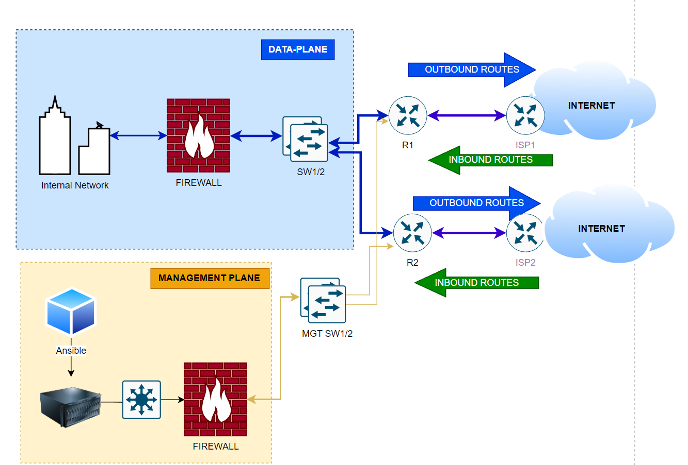
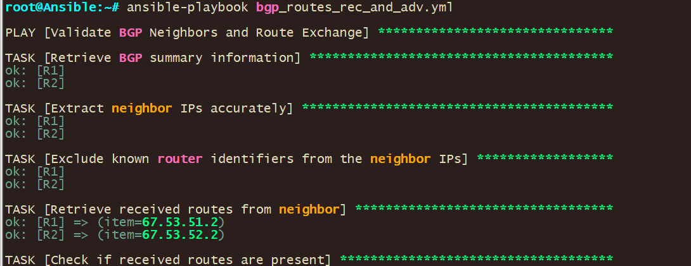

# BGP Neighbor Validation and Route Exchange Monitoring

This Ansible playbook was created for automating the validation of BGP neighbors and route exchange monitoring in a network environment.

**Use Case**: In a large-scale network environment, it is crucial to ensure that Border Gateway Protocol (BGP) neighbors are in a valid state and exchanging routes correctly. Manually verifying the status of each BGP neighbor can be time-consuming and prone to errors. To streamline this process and improve network reliability, I have developed an Ansible playbook that automates the validation of BGP neighbors and route exchange.

\*Please note this is for IOS-XR since it’s the playbook is using Regex that modification will need to be done before the playbook can be used on other platforms.





Key features of this playbook include:

1.  **Retrieval of BGP summary information**: The playbook starts by gathering the BGP summary data from the target routers using the ios_command module. This information provides an overview of the BGP neighbors and their states.
2.  **Extraction and filtering of neighbor IPs**: The playbook intelligently extracts the neighbor IP addresses from the BGP summary output using regular expressions. It then filters out known router identifiers to focus on the relevant BGP neighbors.
3.  **Validation of received routes**: For each filtered neighbor IP, the playbook retrieves the received routes using the ios_command module. It then asserts that the received routes are present and not empty, providing informative success or failure messages.
4.  **Validation of advertised routes**: Similarly, the playbook retrieves the advertised routes for each neighbor IP and verifies that routes are being advertised successfully. This ensures that the BGP sessions are not only established but also exchanging routes as expected.

**Playbook**

```
---
- name: Validate BGP Neighbors and Route Exchange
  hosts: R1, R2
  gather_facts: false
  connection: local


  vars:
    cli:
      username: user
      password: password
      authorize: yes
      auth_pass: password
    known_router_identifiers:
      - 172.16.1.1
      - 172.16.2.1

  tasks:
    - name: Retrieve BGP summary information
      ios_command:
        commands: 
          - show ip bgp summary
        provider: "{{ cli }}"
      register: bgp_summary

    - name: Extract neighbor IPs accurately
      set_fact:
        neighbor_ips: "{{ bgp_summary.stdout[0] | regex_findall('\\n(\\d+\\.\\d+\\.\\d+\\.\\d+)') }}"
    
    - name: Exclude known router identifiers from the neighbor IPs
      set_fact:
        filtered_neighbor_ips: "{{ neighbor_ips | difference(known_router_identifiers) }}"

    # Validate received prefixes from each BGP neighbor
    - name: Retrieve and check received routes from each neighbor
      block:
        - name: Retrieve received routes from neighbor
          ios_command:
            commands: 
              - "show ip bgp neighbors {{ item }} routes"
            provider: "{{ cli }}"
          register: received_routes
          loop: "{{ filtered_neighbor_ips }}"

        - name: Check if received routes are present
          assert:
            that: 
              - "'Total number of prefixes 0' not in received_routes.results | map(attribute='stdout') | join(' ')"
            fail_msg: "No routes are being received from neighbor {{ item.item }}"
            success_msg: "Routes are being received from neighbor {{ item.item }}"
          loop: "{{ received_routes.results }}"

    # Insert a real wait of 2 seconds
    - name: Wait for 2 seconds
      pause:
        seconds: 2

    # Debug message after wait
    - name: Debug message post-wait
      debug:
        msg: "Completed checking received routes, moving to validate advertised prefixes"

    # Validate advertised prefixes to each BGP neighbor
    - name: Retrieve and check advertised routes to each neighbor
      block:
        - name: Retrieve advertised routes to neighbor
          ios_command:
            commands: 
              - "show ip bgp neighbors {{ item }} advertised-routes"
            provider: "{{ cli }}"
          register: advertised_routes
          loop: "{{ filtered_neighbor_ips }}"

        - name: Check if advertised routes are present
          assert:
            that: 
              - "'Total number of prefixes 0' not in advertised_routes.results | map(attribute='stdout') | join(' ')"
            fail_msg: "No routes are being advertised to neighbor {{ item.item }}"
            success_msg: "Routes are being advertised to neighbor {{ item.item }}"
          loop: "{{ advertised_routes.results }}"
```

The playbook, named " bgp_routes_rec_and_adva.yml" leverages the power of Ansible to connect to network devices (routers R1 and R2) and retrieve BGP summary information using the "show ip bgp summary" command. It then extracts the neighbor IP addresses and their corresponding state and prefixes received values.

To focus on external BGP neighbors, the playbook filters out known router identifiers specified in the "known_router_identifiers" variable. This allows network administrators to concentrate on the status of external BGP peerings.

The playbook proceeds to validate the state and prefixes received for each remaining BGP neighbor. It checks if the state is not in an invalid condition (e.g., "Active," "Idle," or "Connect") and verifies that prefixes have been received. If any neighbor fails these checks, the playbook raises an assertion and provides a detailed error message indicating the specific neighbor and the issue encountered.

## 

## To run this playbook, you need the following:

Ansible installed on your local machine or control node. Network devices (routers R1 and R2) accessible via SSH. Ansible inventory file containing the necessary host information. Required Ansible roles and collections installed (e.g., ios collection for Cisco IOS/IOSXR devices).

By automating the validation process, network administrators can quickly identify any issues with BGP neighbor relationships or route exchange. This proactive approach helps prevent network outages, improves troubleshooting efficiency, and enhances overall network stability.

The playbook's modular structure and use of Ansible best practices make it easily extensible and adaptable to different network environments. It can be integrated into larger network automation workflows, enabling continuous monitoring and validation of BGP configurations.

In summary, this Ansible playbook provides a powerful and efficient solution for automating the validation of BGP neighbor relationships and route exchange. By leveraging this playbook, network administrators can ensure the health and stability of their BGP-based networks, reducing manual effort and minimizing the risk of configuration errors.

**Acknowledgments**; I would like to acknowledge the Ansible community for their valuable contributions and the development of modules and plugins that made this playbook possible.
