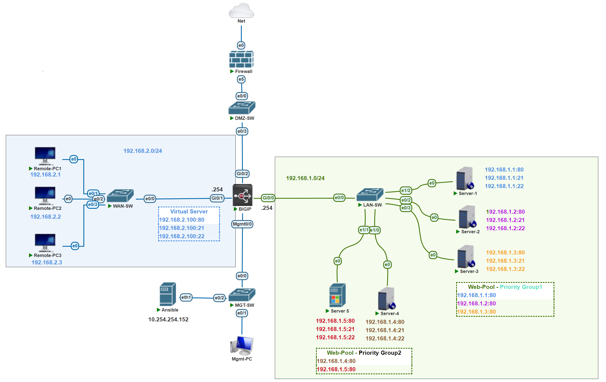
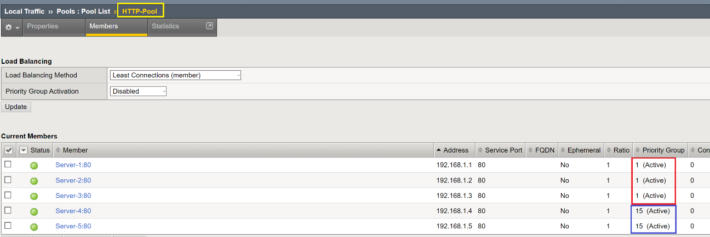
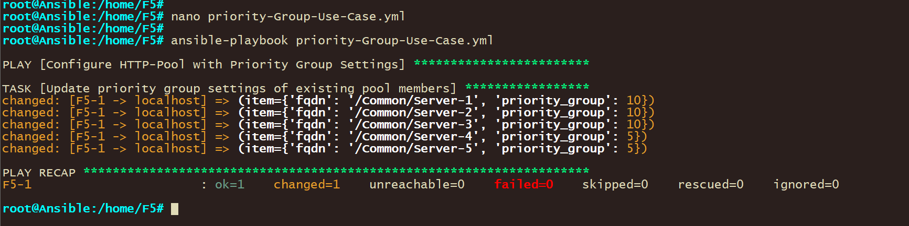
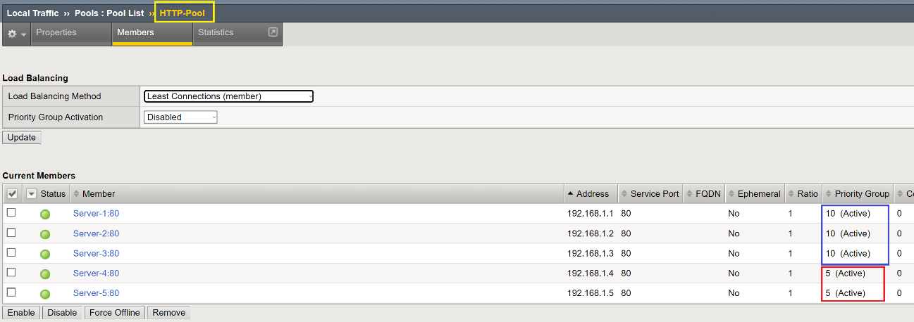

**Use Case: Enhancing Web Application Performance with Priority-Based Load Balancing**

## Overview

A leading web application faces challenges in maintaining optimal performance and availability, especially during varying traffic conditions. The application infrastructure is hosted across five servers, with certain servers designated as primary due to their higher specifications, reliability, and closer proximity to the majority of users. To ensure a seamless user experience and efficient use of resources, the application team seeks to implement a priority-based load balancing strategy using an F5 BIG-IP load balancer.



## Objective

Implement a dynamic, priority-based load balancing solution that optimizes web application performance by preferentially directing traffic to the primary servers under normal conditions, while still utilizing secondary servers as needed, all managed through Ansible automation.

## Solution

Deploy an Ansible playbook to configure an F5 BIG-IP load balancer with a single pool named HTTP-Pool, containing all 5 servers. The first 3 servers (server-1 to server-3) are set as primary and assigned to a higher priority group, indicating they should handle the majority of the traffic. The remaining two servers (server-4 and server-5) are designated as secondary, with a lower priority, to be used when the primary servers are at capacity or to ensure availability during maintenance or unexpected downtime.

### Implementation Steps

-   **Preparation**: Ensure Ansible is installed and has network access to the F5 BIG-IP device. Collect the necessary credentials and IP addresses for the F5 BIG-IP management interface and all server endpoints.
-   **Playbook Configuration:** Utilize the provided Ansible playbook, which is designed to:
    -   Verify or create the HTTP-Pool on the F5 BIG-IP device.
    -   Configure each server in the pool with the appropriate priority group setting, based on their role as primary or secondary servers.
-   **Execution:** Run the Ansible playbook to apply the configurations. This process automatically sets up the priority groups within the HTTP-Pool, aligning with the predetermined traffic management strategy.
-   **Verification and Monitoring:** After applying the configurations, monitor the application's performance and the distribution of traffic across the servers. Utilize F5 BIG-IP's monitoring tools to ensure traffic is preferentially directed to the primary servers, with the secondary servers providing additional capacity as designed.

## Benefits

-   **Optimized Performance:** By preferentially directing traffic to the primary servers, the web application can leverage their higher specifications and strategic locations to improve user experience.
-   **Enhanced Availability:** Secondary servers stand by to handle overflow traffic or to provide service continuity during primary server maintenance or unexpected outages.
-   **Scalability and Flexibility:** The Ansible playbook can be easily adjusted and rerun to accommodate changes in the server infrastructure, such as adding new servers or changing priority group assignments.
-   **Reduced Manual Intervention**: Automating the configuration process minimizes the potential for human error and frees up IT staff to focus on other strategic tasks.

## Conclusion

This use-case demonstrates the power of combining Ansible automation with F5 BIG-IP load balancing to implement a priority-based traffic management solution. By carefully directing traffic to the most capable servers while maintaining a robust failover strategy, the web application can achieve both high performance and reliability, ensuring a superior user experience.

**Playbook**

```
---
- name: Validate BGP Neighbors and Route Exchange
  hosts: R1, R2
  gather_facts: false
  connection: local


  vars:
    cli:
      username: user
      password: password
      authorize: yes
      auth_pass: password
    known_router_identifiers:
      - 172.16.1.1
      - 172.16.2.1

  tasks:
    - name: Retrieve BGP summary information
      ios_command:
        commands: 
          - show ip bgp summary
        provider: "{{ cli }}"
      register: bgp_summary

---
- name: Configure HTTP-Pool with Priority Group Settings
  hosts: F5
  connection: local
  gather_facts: no

  vars:
    bigip_host: F5-1
    bigip_admin: "admin"
    bigip_password: "Abc@Admin1"
    provider:
      server: "{{ bigip_host }}"
      user: "{{ bigip_admin }}"
      password: "{{ bigip_password }}"
      validate_certs: no
      server_port: 443

  tasks:
    - name: Update priority group settings of existing pool members
      bigip_pool_member:
        pool: "HTTP-Pool"
        partition: "Common"
        fqdn: "{{ item.fqdn }}"
        port: "{{ item.port | default(80) }}"
        priority_group: "{{ item.priority_group }}"
        state: "present"
        provider: "{{ provider }}"
      loop:
        - { fqdn: "/Common/Server-1", priority_group: 10 }
        - { fqdn: "/Common/Server-2", priority_group: 10 }
        - { fqdn: "/Common/Server-3", priority_group: 10 }
        - { fqdn: "/Common/Server-4", priority_group: 5 }
        - { fqdn: "/Common/Server-5", priority_group: 5 }
      delegate_to: localhost
```

## Pre-Playbook Deployment

Server-1, Server-2 and Server-3 are part of **Priority Group 1**

Server-4 and server-5 are part of **Priority Group 15**



## Playbook Deployment



## Post-Playbook Deployment

Server-1, Server-2 and Server-3 are part of **Priority Group 5**

Server-4 and server-5 are part of **Priority Group 10**


