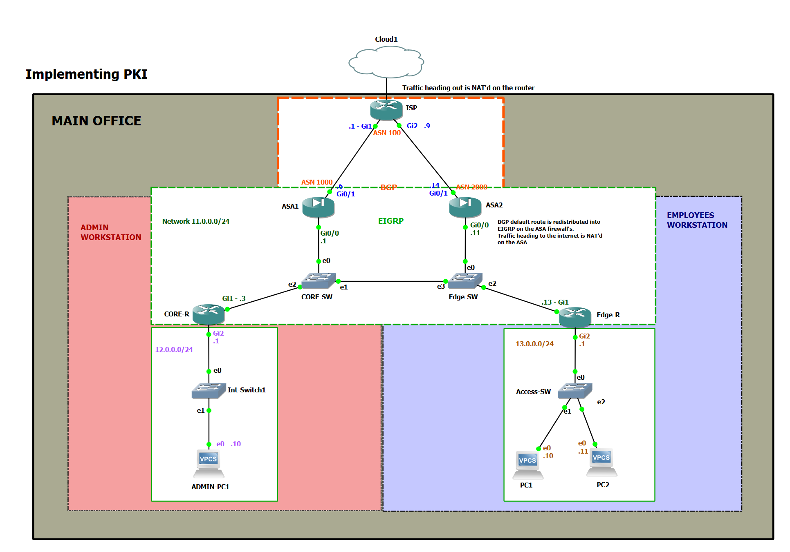
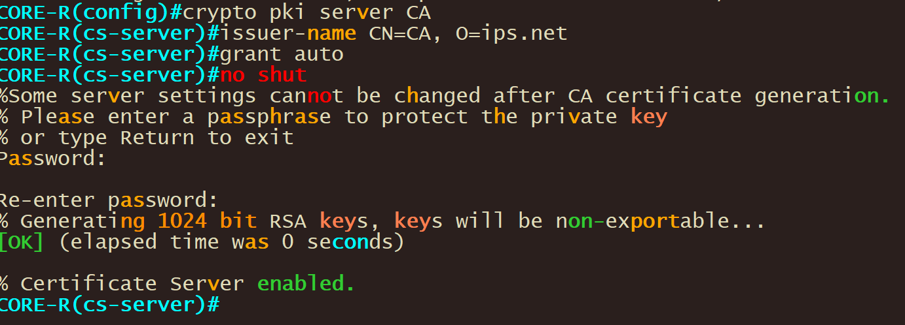

# Basic Cryptography and PKI

This Lab exercise explores the utilization of cryptography for the distribution, management, and revocation of encryption and identification information within an enterprise network. The Public Key Infrastructure (PKI) infrastructure is implemented between the CORE-R (Certificate Authority) and EDGE-R (client). Upon enrollment in the PKI, each peer, also referred to as an end host, is issued a digital certificate by the CA. When establishing secure communication sessions, peers exchange digital certificates. Through examination of the information contained within the certificate, a peer can verify the identity of another peer and establish an encrypted session utilizing the public keys contained within the certificate. It is important to note that this laboratory represents an enterprise network scenario, with firewalls (ASA1 & ASA2) configured with BGP and EIGRP. The default route is propagated downstream to CORE-R & EDGE-R through BGP to EIGRP redistribution. As technology evolves, it is imperative that we evolve with it, embracing progress and adapting to new developments to ensure continued success and competitiveness.



## Main things done in lab.

1.  Configure crypto PKI Server on CORE-R
2.  Crypto key generation on Edge-R
3.  Configure crypto PKI trustpoint on Edge-R
4.  Configure crypto PKI authentication on Edge-R
5.  Configure crypto PKI enrollment on Edge-R

## 

## CLI blocks

**Configuration for PKI Server on CA Server ( CORE-R )**

```
CORE-R#config t
Enter configuration commands, one per line.  End with CNTL/Z.
CORE-R(config)#clock timezone GST 4
CORE-R(config)#do clock set 16:18:00 28 apr 2023
CORE-R(config)#ip http
CORE-R(config)#crypto pki server CA
CORE-R(cs-server)#issuer-name CN=CA, O=ips.net
CORE-R(cs-server)#grant auto
CORE-R(cs-server)#no shut 
```

Output



**Configuration for CA Client ( Edge-R )**

```
Edge-R(config)#clock timezone GST 4
Edge-R(config)#do clock set 16:35:00 28 apr 2023
Edge-R(config)#crypto key generate rsa general-keys label Edge-R.ips.net 
Edge-R(config)#crypto pki trustpoint Trusted-CA
Edge-R(ca-trustpoint)# enrollment url http://11.0.0.3:80
Edge-R(ca-trustpoint)# serial-number
Edge-R(ca-trustpoint)# fqdn Edge-R.ips.net
Edge-R(ca-trustpoint)# subject-name CN=Edge-R, O=ips.net
Edge-R(ca-trustpoint)# revocation-check none
Edge-R(ca-trustpoint)# rsakeypair Edge-R.ips.net
Edge-R(ca-trustpoint)#exit
Edge-R(config)#crypto pki authenticate Trusted-CA

Edge-R(config)#do show crypto pki certificates
```

## Device info

Here are some of the information on lab devices

| **Hostname** | USE-CASE                                                                    | **BGP** | **EIGRP** |
|--------------|-----------------------------------------------------------------------------|---------|-----------|
| ISP          | Connects to the internet and sends default Route down to the Firewalls.     | YES     | NO        |
| ASA1         | Admin workstation firewall. Connects to the internet vial link to ISP.      | YES     | YES       |
| ASA2         | Employee’s workstation firewall. Connects to the internet vial link to ISP. | YES     | YES       |
| CORE-R       | Admin workstation router originates 12.0.0.0/24 Subnet                      | NO      | YES       |
| EDGE-R       | Employee workstation router originates 12.0.0.0/24 Subnet                   | NO      | YES       |

## 
