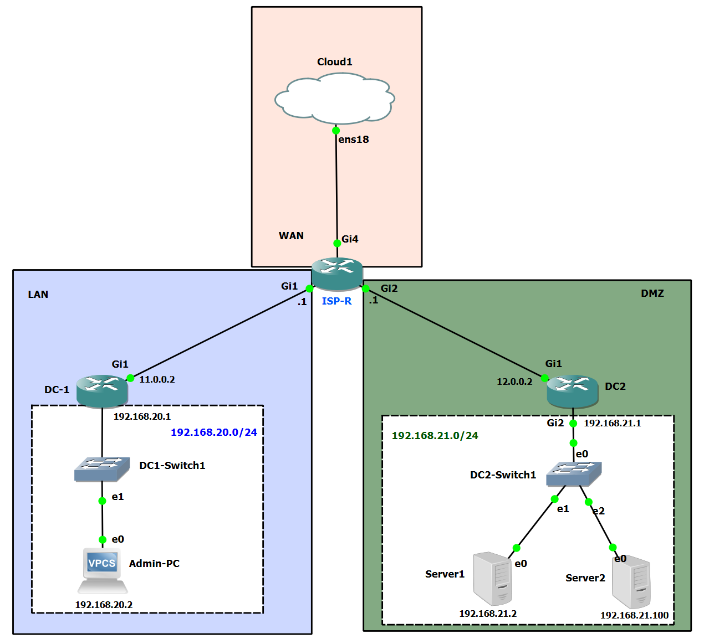

# Cisco IOS – Zone-Based Firewall (ZBF) / Zone-policy Firewall (ZFW)

This lab activity delves into the use of a feature present in Cisco IOS known as the Zone Based Firewall (ZBF). The ZBF, also referred to as the Zone-Policy Firewall, allows Cisco routers to perform stateful firewall inspection. This feature enables deep packet inspection similar to that of the Layer 7 inspection provided by the ASA. The ZBF represents the most sophisticated method of stateful firewall inspection that is currently available in Cisco IOS routers. The concept behind the ZBF is to establish distinct zones, rather than assigning access-lists to interfaces. Interfaces are assigned to these zones and security policies are implemented to control the flow of traffic between these zones.

When it comes to configuring a Zone-Based Firewall, it is essential to note that it is distinct from the conventional Context-Based Access Control (CBAC) firewall setup. Instead of individually assigning firewall policies and access-lists to each interface, the Zone-Based Firewall organizes the network into separate zones with unique access control and traffic management policies.

Typically, these zones consist of a private zone for internal network interfaces, a public zone for interfaces connecting to public networks, and a DMZ (Demilitarized Zone) for interfaces serving public servers. Interfaces are only permitted to belong to one zone at a time. However, the number of zones is not restricted to this common arrangement.

The Zone-Based Firewall setup has several benefits over the previous CBAC method, including reduced complexity and a streamlined setup and modification process. This is due to the requirement of fewer configuration commands for each interface, making the configuration process less time-consuming. It is important to note that this lab represents an simple lab network scenario, with firewalls (DC1 & DC2) pointing to the ISP-Router for the default lab.

## IOS Firewall – Zone-Based Firewall

-   Stateful Firewall implementation on Cisco IOS Routers
-   Like ASA, layer 7 deep packet inspection is supported
-   Works on the concept of Security zones
-   Firewall policies bult between security zones
-   Default policy is to block all traffic unless explicitly allowed
-   Replaces old concept of CBAC
-   Was introduced in 2006 with Cisco IOS release 12.4(6)T

**Main things done in lab.**

1.  Configure routers(DC-1/2) to point towards ISP-R for Default Route
2.  Configure the Zones
3.  Configure Zone pairs
4.  Create Security Policies

## Configuration

We will use the following topology:

Here are some of the information on lab devices

| **Hostname** | USE-CASE                                                                |
|--------------|-------------------------------------------------------------------------|
| ISP-R        | Connects to the internet and sends default Route down to the Firewalls. |
| DC-1         | Lan Router connecting to Admin-PC                                       |
| DC-2         | DMZ connecting to two servers                                           |

Above you see 3 routers and three zones called LAN, DMZ and WAN. We will configure ZBF on ISP-R. For connectivity, we create a static route on DC-1 and DC-2 that points to R2:

```
DC-1#config t
Enter configuration commands, one per line.  End with CNTL/Z.
DC-1(config)#ip route 0.0.0.0 0.0.0.0 11.0.0.1

DC-2#config t
Enter configuration commands, one per line.  End with CNTL/Z.
DC-2(config)#ip route 0.0.0.0 0.0.0.0 12.0.0.1
```

Verify connectivity to the internet:

```
DC-1#ping 1.1.1.1
Type escape sequence to abort.
Sending 5, 100-byte ICMP Echos to 1.1.1.1, timeout is 2 seconds:
!!!!!
Success rate is 100 percent (5/5), round-trip min/avg/max = 21/22/24 ms

DC-2# ping 1.1.1.1
Type escape sequence to abort.
Sending 5, 100-byte ICMP Echos to 1.1.1.1, timeout is 2 seconds:
!!!!!
Success
```

## Configure the Zones

First we have to create the three zones:

```
ISP-R#config t
Enter configuration commands, one per line.  End with CNTL/Z.
ISP-R(config)#zone security LAN
ISP-R(config-sec-zone)#Zone security WAN
ISP-R(config-sec-zone)#zone security DMZ
```

Next assign the interfaces to the correct zone:

```
ISP-R#CONFIG T
Enter configuration commands, one per line.  End with CNTL/Z.
ISP-R(config)#interface GigabitEthernet1
ISP-R(config-if)#zone-member security LAN
ISP-R(config-if)#interface gi
ISP-R(config-if)#interface GigabitEthernet2
ISP-R(config-if)#zone-member security DMZ
ISP-R(config-if)# 
ISP-R(config-if)#interface GigabitEthernet4
ISP-R(config-if)#zone-member security WAN
```

Verify the configuration of the zones with the **show zone security command**.

```
ISP-R#show zone security
zone self
  Description: System defined zone
zone LAN
  Member Interfaces:
    GigabitEthernet1
zone WAN
  Member Interfaces:
    GigabitEthernet4
zone DMZ
  Member Interfaces:
    GigabitEthernet2
ISP-R#
```

## Configure the Zone Pairs

Create four zone pairs. One for traffic from LAN to WAN, and another for traffic from WAN to LAN. Secondary a zone pair from DMZ to WAN and lastly for traffic from WAN to LAN.

```
ISP-R#config t
Enter configuration commands, one per line.  End with CNTL/Z.
ISP-R(config)#zone-pair security LAN-TO-WAN source LAN destination WAN
ISP-R(config-sec-zone-pair)#
ISP-R(config-sec-zone-pair)#description LAN-TO-WAN TRAFFIC
ISP-R(config-sec-zone-pair)#$ecurity WAN-TO-LAN source WAN destination LAN   
ISP-R(config-sec-zone-pair)#
ISP-R(config-sec-zone-pair)#description WAN-TO-LAN TRAFFIC
ISP-R(config-sec-zone-pair)#$ecurity DMZ-TO-WAN source DMZ destination WAN   
ISP-R(config-sec-zone-pair)#
ISP-R(config-sec-zone-pair)#description DMZ-TO-WAN TRAFFIC
ISP-R(config-sec-zone-pair)#$ecurity WAN-TO-DMZ source WAN destination DMZ   
ISP-R(config-sec-zone-pair)#
ISP-R(config-sec-zone-pair)#description WAN-TO-DMZ TRAFFIC
ISP-R(config-sec-zone-pair)#end
```

Verify configuration for the zone pair with the **show zone-pair security** command:

```
ISP-R#show zone-pair security
Zone-pair name DMZ-TO-WAN
Description: DMZ-TO-WAN TRAFFIC
    Source-Zone DMZ  Destination-Zone WAN 
    service-policy not configured
Zone-pair name LAN-TO-WAN
Description: LAN-TO-WAN TRAFFIC
    Source-Zone LAN  Destination-Zone WAN 
    service-policy not configured
Zone-pair name WAN-TO-DMZ
Description: WAN-TO-DMZ TRAFFIC
    Source-Zone WAN  Destination-Zone DMZ 
    service-policy not configured
Zone-pair name WAN-TO-LAN
Description: WAN-TO-LAN TRAFFIC
    Source-Zone WAN  Destination-Zone LAN
```

Verify that the zone pairs are working by trying to reach the internet on DC-1 & DC-2. By default, all traffic will be blocked.

```
DC-1#ping 1.1.1.1
Type escape sequence to abort.
Sending 5, 100-byte ICMP Echos to 1.1.1.1, timeout is 2 seconds:
.....
Success rate is 0 percent (0/5)
DC-2#ping 1.1.1.1
Type escape sequence to abort.
Sending 5, 100-byte ICMP Echos to 1.1.1.1, timeout is 2 seconds:
.....
Success rate is 0 percent (0/5)
```

## Create Security Policies

We’ll create a simple security policy that allows ICMP traffic from the LAN and DMZ to the WAN:

There are three actions that can be applied to traffic:

-   **Pass**: traffic is permitted.
-   **Drop**: traffic is dropped.
-   **Inspect**: traffic is permitted and inspected so that return traffic is allowed.

Next, we create a Inspect class-map that uses Network Based Application Recognition to match ICMP traffic and a policy-map called ICMP-TO-WAN that inspects ICMP traffic and allows it to pass the LAN/DMZ zone to the WAN zone but also allows the return traffic. Than we apply the policy-map to the zone pair.

```
ISP-R(config)#class-map type inspect ICMP
ISP-R(config-cmap)#match protocol icmp
ISP-R(config-cmap)#policy-map type inspect ICMP-TO-WAN
ISP-R(config-pmap)#class type inspect ICMP
ISP-R(config-pmap-c)#inspect
ISP-R#config t
Enter configuration commands, one per line.  End with CNTL/Z.
ISP-R(config)#zone-pair security LAN-TO-WAN
ISP-R(config-sec-zone-pair)#service-policy type inspect ICMP-TO-WAN
ISP-R(config-sec-zone-pair)#
ISP-R(config-sec-zone-pair)#zone-pair security DMZ-TO-WAN
ISP-R(config-sec-zone-pair)#service-policy type inspect ICMP-TO-WAN
ISP-R(config-sec-zone-pair)#end
```

Policy-maps are directly attached to the zone pair that were created you can verify the configuration by pinging out to the internet.

```
DC-1#ping 1.1.1.1
Type escape sequence to abort.
Sending 5, 100-byte ICMP Echos to 1.1.1.1, timeout is 2 seconds:
!!!!!
Success rate is 100 percent (5/5), round-trip min/avg/max = 22/24/27 ms
DC-2#ping 1.1.1.1
Type escape sequence to abort.
Sending 5, 100-byte ICMP Echos to 1.1.1.1, timeout is 2 seconds:
!!!!!
Success rate is 100 percent (5/5), round-trip min/avg/max = 22/23/26 ms
```
